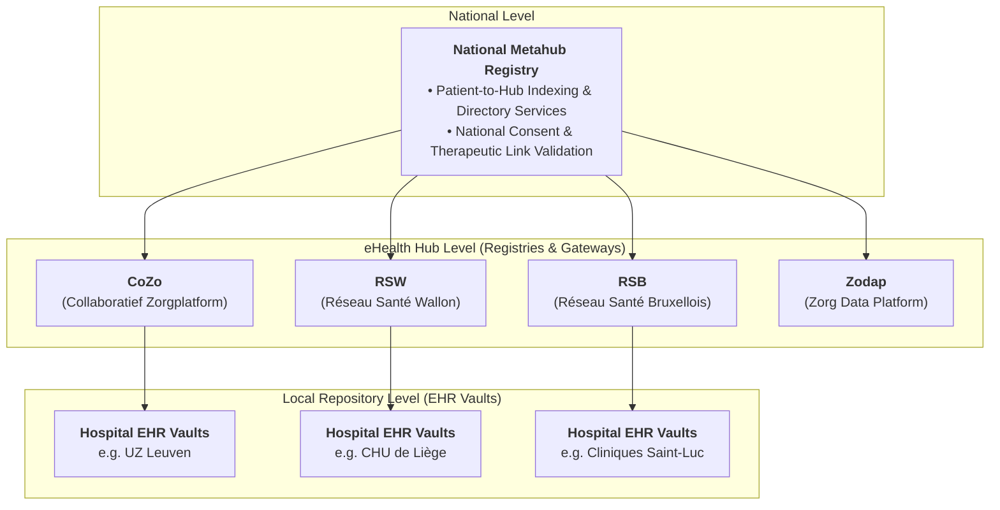
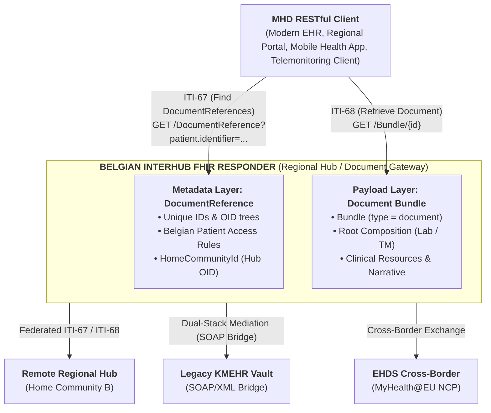
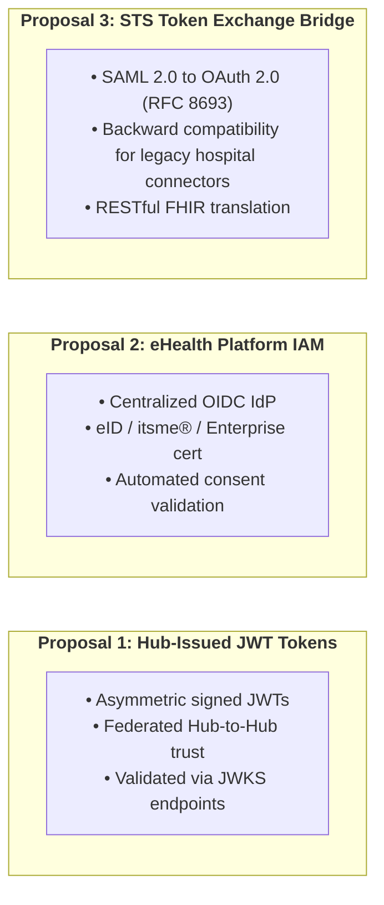

# Belgian Interhub Architecture & Federation Model

## 1. The Belgian Federated Health Ecosystem

The Belgian healthcare infrastructure is built upon a **federated, decentralized architecture** governed by the eHealth Platform (`ehealth.fgov.be`). Unlike centralized national repositories, clinical data in Belgium resides locally within hospital electronic health record (EHR) vaults, private clinical laboratories, and regional hubs.

### 1.1 Key Actors & Nodes in the Network

1. **National Metahub**:
   * Acts as a central directory indicating which regional hubs hold documents for a specific patient (identified by their national **SSIN / INSS**).
   * Verifies national patient consent and registers therapeutic links between healthcare providers and patients.
2. **eHealth Hubs**:
   * **CoZo** (Collaboratief Zorgplatform).
   * **RSW** (Réseau Santé Wallon).
   * **RSB** (Réseau Santé Bruxellois).
   * **Zodap** (Zorg Data Platform).
   * Each hub acts as a regional Document Registry and Document Gateway, managing indexing, local access control, and cross-hub routing.
3. **Hospital EHR Vaults & Clinical Repositories**:
   * Authoritative source systems where clinical documents (laboratory reports, discharge summaries, imaging studies, telemonitoring records) are created, validated, and stored.

---

## 2. Evolution: From SOAP KMEHR to RESTful FHIR MHD

Historically, Interhub communication was specified using SOAP Web Services exchanging XML payloads conforming to Belgian **KMEHR** schemas (`getTransactionList`, `getTransaction`, `putTransaction`, `getTransactionAccessList`).

The modernized Belgian Interhub specification adopts **IHE MHD (Mobile access to Health Documents)** on **HL7® FHIR® R4**, creating a standardized, RESTful architecture:

---

## 3. Federated Cross-Hub Routing & Identifiers

In a cross-hub scenario, an **Initiating Hub** queries or retrieves documents from one or more **Responding Hubs**. Routing is governed by standardized identifiers registered in the Belgian eHealth OID tree (`1.3.6.1.4.1.21297`):

### 3.1 Belgian National Identifiers

| Concept | URI / System | OID Root | Description & Syntax Example |
| :--- | :--- | :--- | :--- |
| **Patient SSIN / INSS** | `https://www.ehealth.fgov.be/standards/fhir/core/NamingSystem/ssin` | `1.3.6.1.4.1.21297.100.1.1` | National Social Security Identification Number (e.g. `79080412345`). |
| **Practitioner NIHDI / RIZIV** | `https://www.ehealth.fgov.be/standards/fhir/core/NamingSystem/nihdi` | `1.3.6.1.4.1.21297.100.9.1` | Healthcare professional license number (11 digits, e.g. `19876543201`). |
| **Hospital / Facility NIHDI** | `https://www.ehealth.fgov.be/standards/fhir/core/NamingSystem/nihdi` | `1.3.6.1.4.1.21297.100.11.1` | Healthcare institution accreditation number (8 digits, e.g. `71000012`). |
| **Enterprise CBE / KBO** | `https://www.ehealth.fgov.be/standards/fhir/core/NamingSystem/cbe` | `1.3.6.1.4.1.21297.100.11.2` | Crossroads Bank for Enterprises business number (10 digits, e.g. `0419052173`). |
| **Hub Home Community ID** | `urn:ietf:rfc:3986` | `1.3.6.1.4.1.21297.1.X` | URN OID identifying the regional hub (e.g. `urn:oid:1.3.6.1.4.1.21297.1.3` for CoZo). |
| **Repository Unique ID** | `urn:ietf:rfc:3986` | `1.3.6.1.4.1.21297.100.2.X` | Identifies the physical document storage repository within a hub network. |
| **CD-TRANSACTION** | `https://www.ehealth.fgov.be/standards/fhir/core/CodeSystem/cd-transaction` | `1.3.6.1.4.1.21297.100.3.1` | Document category coding system (e.g. `sumehr`, `labresult`, `telemonitoring`). |

### 3.2 Routing Mechanics via `homeCommunityId`

1. **Discovery (`getTransactionList` / ITI-67)**:
   * The initiating hub retrieves the patient links (originally stored in the metahub) and queries each of the eHealth Hubs for the list.
   * Every returned `BeInterhubDocumentReference` contains the mandatory extension `homeCommunityId` (e.g. `urn:oid:1.3.6.1.4.1.21297.1.3`).
2. **Retrieval (`getTransaction` / ITI-68)**:
   * The consumer inspects `DocumentReference.content.attachment.url` and `homeCommunityId` to dispatch the retrieval request directly to the authoritative repository hosting the document bundle.

---

## 4. Dual-Stack Gateway Architecture (Transition Phase)

To enable smooth migration without breaking legacy integrations, Belgian Hubs deploy a **Dual-Stack Mediation Gateway**:

* **Legacy KMEHR Client $\rightarrow$ Modern FHIR Hub**: The gateway receives SOAP `getTransactionList` or `getTransaction` requests, queries the internal FHIR registry/repository via MHD ITI-67 / ITI-68, and transforms the resulting `DocumentReference` and `Bundle (type=document)` back into KMEHR `TransactionSummaryType` or `FolderType` XML.
* **Modern FHIR Client $\rightarrow$ Legacy KMEHR Vault**: The gateway accepts RESTful MHD searches and GET requests, translates them into SOAP KMEHR Web Service calls to legacy hospital vaults, transforms the returned KMEHR XML / attachments into standardized FHIR Document Bundles, and returns them to the client.

---

## 5. Security Architecture & Connection Routes (Proposal)

All Interhub transactions operate under strict Belgian healthcare regulations, the Patient Rights Act, and GDPR compliance. The security architecture provides three distinct connection routes to accommodate integration requirements. 

> **Important Architectural Note**: The three connection models presented below represent an **architectural proposal**. The final Belgian Interhub standard will **select and mandate one of these three methods** as the unified national authentication framework.

1. **Route 1: Hub/Enterprise-Issued JWTs**: Direct peer-to-peer trust federation between regional hubs using asymmetric signed JWT bearer tokens validated against public JWKS endpoints.
2. **Route 2: eHealth Platform IAM**: Centralized identity and access management through the national eHealth OIDC provider, resolving authenticated practitioner NIHDI licenses and institution CBE numbers.
3. **Route 3: STS Token Exchange Bridge**: Seamless backward compatibility bridge translating legacy SOAP WS-Trust / SAML 2.0 assertions from the eHealth STS into short-lived OAuth 2.0 JWTs (RFC 8693).

In addition, to replace legacy SOAP SAML request signatures and guard against replay attacks and query parameter manipulation in the RESTful FHIR space, all routes evaluate **DPoP (RFC 9449)** and **RFC 9421 (HTTP Message Signatures)**.

For complete technical specifications, see **[Interhub Security Architecture](security.html)** and the **[End-to-End Encryption Discussion Paper](end-to-end-encryption.html)**.
