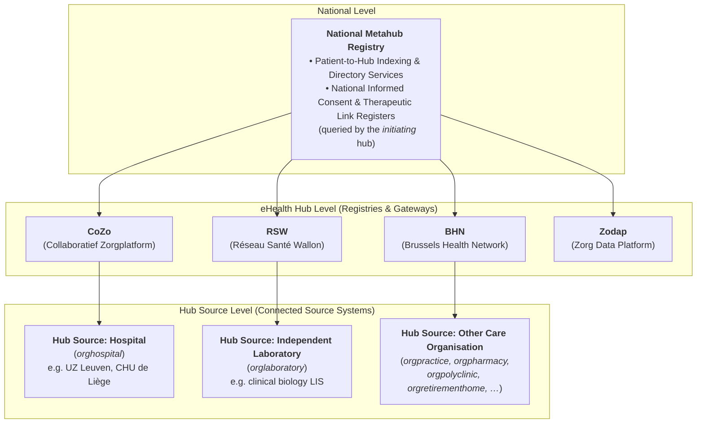
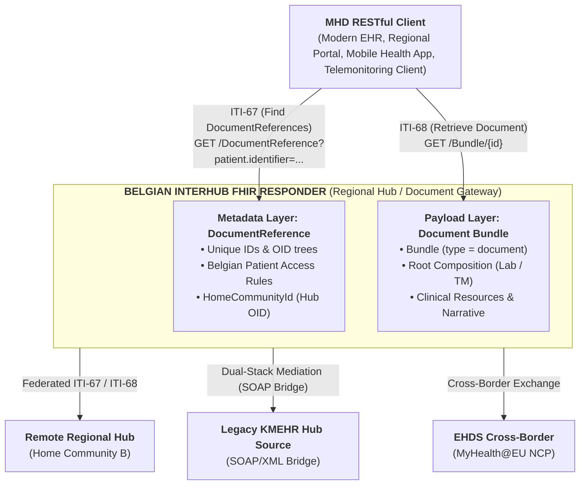
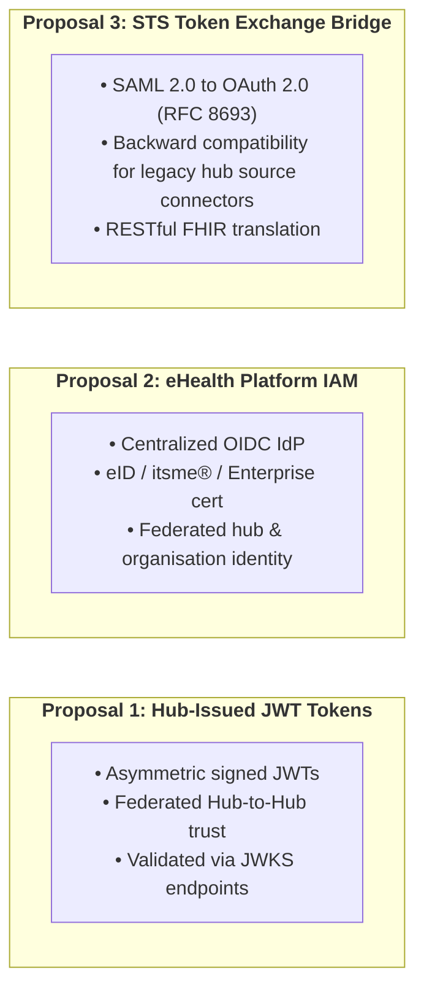

# Belgian Interhub Architecture & Federation Model

> **Where this page sits in the guide** — *Architecture*, page 1 of 2. This page is the **map** of the ecosystem; the pages it names are the specification of the individual pieces.
>
> * **Owned by this page:** the metahub / hub / hub source model, what counts as a hub source, federated routing and `homeCommunityId`, and the dual-stack transition gateway.
> * **Summarised here, specified in full elsewhere:** the metadata envelope → [Envelope & Metadata](envelope-and-metadata.html); the two transactions → [Transactions](transactions.html); authentication, tamper-proofing and auditing → [Security & Authentication](security.html); payload encryption → [End-to-End Encryption](end-to-end-encryption.html); the SOAP crosswalk behind the dual-stack gateway → [KMEHR to FHIR Mapping](mapping-kmehr-to-hub.html).
> * **Next:** [Design Rationale](resource-considerations.html) — why this architecture shares FHIR *documents* rather than messages or granular resources.

## 1. The Belgian Federated Health Ecosystem

The Belgian healthcare infrastructure is built upon a **federated, decentralized architecture** governed by the eHealth Platform (`ehealth.fgov.be`). Unlike centralized national repositories, clinical data in Belgium resides locally in the **hub sources** — the source systems of the care organisations that produce it (hospitals, independent laboratories, pharmacies, polyclinics, practice organisations, care homes, and every other organisation type of the KMEHR `CD-HCPARTY` classification) — and is indexed and routed by the regional hubs.

### 1.1 Key Actors & Nodes in the Network

1. **National Metahub**:
   * Acts as a central directory indicating which regional hubs hold documents for a specific patient (identified by their national **SSIN / INSS**).
   * Holds the national registers of informed consent (IC) and therapeutic links. These registers are consulted by the **initiating hub** when it performs its own access control, before it emits an Interhub request.
2. **eHealth Hubs**:
   * **CoZo** (Collaboratief Zorgplatform).
   * **RSW** (Réseau Santé Wallon).
   * **BHN** (Brussels Health Network).
   * **Zodap** (Zorg Data Platform).
   * Each hub acts as a regional Document Registry and Document Gateway, managing indexing and cross-hub routing. When a hub *initiates* a query, it is also the actor responsible for access control (see §5).
3. **Hub Sources (Connected Source Systems & Clinical Repositories)**:
   * Authoritative source systems where clinical documents (laboratory reports, discharge summaries, imaging studies, telemonitoring records) are created, validated, and stored.
   * A hub source is **any** connected care organisation — not only a hospital (see §1.2).

### 1.2 What Counts as a Hub Source

A **hub source** is any care organisation whose source system publishes documents to, and answers retrievals for, a hub. Hospitals are one example among many: the KMEHR `CD-HCPARTY` organisation types show the actual range.

| Code | Organisation type | Code | Organisation type |
| :--- | :--- | :--- | :--- |
| `orghospital` | Hospital | `orgprevention` | Prevention organisation |
| `orglaboratory` | Independent laboratory | `orgprimaryhealthcarecenter` | Primary health care center |
| `orgpharmacy` | Independent pharmacy | `orgpsychiatriccarehome` | Psychiatric care home |
| `orgpharmacyinvoicingoffice` | Pharmacy invoicing office | `orgpublichealth` | Public health organisation |
| `orgpolyclinic` | Polyclinic | `orgretirementhome` | Retirement home |
| `orgpractice` | Practice organisation | `orgrevalidationcenter` | Revalidation center |
| `orginsurance` | Insurance | `orgshelteredliving` | Sheltered living |

Throughout this implementation guide, **"hub source"** designates this entire class of systems. Where a hospital, a laboratory or a retirement home is named, it is only ever an *example* of a hub source, never a restriction of the model. The `CD-HCPARTY` codes themselves — and every other KMEHR code table — are crosswalked to FHIR in [KMEHR to FHIR Mapping](mapping-kmehr-to-hub.html#3-code-system--value-set-crosswalks).

---

## 2. Evolution: From SOAP KMEHR to RESTful FHIR MHD

Historically, Interhub communication was specified using SOAP Web Services exchanging XML payloads conforming to Belgian **KMEHR** schemas (`getTransactionList`, `getTransaction`, `putTransaction`, `getTransactionAccessList`).

The modernized Belgian Interhub specification adopts **IHE MHD (Mobile access to Health Documents)** on **HL7® FHIR® R4**, creating a standardized, RESTful architecture:

The diagram shows the *shape* of the exchange only. Each layer of it is specified on its own page: the **metadata layer** element by element in [Envelope & Metadata](envelope-and-metadata.html#2-element-by-element-specification-beinterhubdocumentreference), the **two transactions** (ITI-67 / ITI-68) in [Transactions](transactions.html), the **cross-border branch** in [EHDS Alignment](ehds-alignment.html), and the reasoning behind carrying payloads as document bundles at all in [Design Rationale](resource-considerations.html#2-evaluation-of-evaluated-carrier-paradigms).

---

## 3. Federated Cross-Hub Routing & Identifiers

In a cross-hub scenario, an **Initiating Hub** queries or retrieves documents from one or more **Responding Hubs**. Responding hubs inherently trust the calling hub: the initiating hub has already performed access control locally (see §5). Routing is governed by standardized identifiers registered in the Belgian eHealth OID tree (`1.3.6.1.4.1.21297`):

### 3.1 Belgian National Identifiers

| Concept | URI / System | OID Root | Description & Syntax Example |
| :--- | :--- | :--- | :--- |
| **Patient SSIN / INSS** | `https://www.ehealth.fgov.be/standards/fhir/core/NamingSystem/ssin` | `1.3.6.1.4.1.21297.100.1.1` | National Social Security Identification Number (e.g. `79080412345`). |
| **Practitioner NIHDI / RIZIV** | `https://www.ehealth.fgov.be/standards/fhir/core/NamingSystem/nihdi` | `1.3.6.1.4.1.21297.100.9.1` | Healthcare professional license number (11 digits, e.g. `19876543201`). |
| **Care Organisation / Facility NIHDI** | `https://www.ehealth.fgov.be/standards/fhir/core/NamingSystem/nihdi` | `1.3.6.1.4.1.21297.100.11.1` | Healthcare institution accreditation number (8 digits, e.g. `71000012`). |
| **Enterprise CBE / KBO** | `https://www.ehealth.fgov.be/standards/fhir/core/NamingSystem/cbe` | `1.3.6.1.4.1.21297.100.11.2` | Crossroads Bank for Enterprises business number (10 digits, e.g. `0419052173`). |
| **Hub Home Community ID** | `urn:ietf:rfc:3986` | `1.3.6.1.4.1.21297.1.X` | URN OID identifying the regional hub (e.g. `urn:oid:1.3.6.1.4.1.21297.1.3` for CoZo). |
| **Repository Unique ID** | `urn:ietf:rfc:3986` | `1.3.6.1.4.1.21297.100.2.X` | Identifies the physical document storage repository within a hub network. |
| **CD-TRANSACTION** | `https://www.ehealth.fgov.be/standards/fhir/core/CodeSystem/cd-transaction` | `1.3.6.1.4.1.21297.100.3.1` | Document category coding system (e.g. `sumehr`, `labresult`, `telemonitoring`). |

These identifiers are bound to concrete `BeInterhubDocumentReference` elements in [Envelope & Metadata](envelope-and-metadata.html#2-element-by-element-specification-beinterhubdocumentreference), and to their legacy KMEHR / IHE XDS.b counterparts in [KMEHR to FHIR Mapping](mapping-kmehr-to-hub.html#2-master-metadata-mapping-matrix).

### 3.2 Routing Mechanics via `homeCommunityId`

1. **Discovery (`getTransactionList` / ITI-67)**:
   * The initiating hub retrieves the patient links (originally stored in the metahub) and queries each of the eHealth Hubs for the list.
   * Every returned `BeInterhubDocumentReference` contains the mandatory extension `homeCommunityId` (e.g. `urn:oid:1.3.6.1.4.1.21297.1.3`).
2. **Retrieval (`getTransaction` / ITI-68)**:
   * The consumer inspects `DocumentReference.content.attachment.url` and `homeCommunityId` to dispatch the retrieval request directly to the authoritative repository hosting the document bundle.

The query syntax for step 1 and the retrieval call for step 2 are specified in [Transactions](transactions.html#2-transaction-1-gettransactionlist-mhd-iti-67-find-documentreferences); the `homeCommunityId` extension itself in [Envelope & Metadata](envelope-and-metadata.html#31-home-community-id-beexthomecommunityid).

---

## 4. Dual-Stack Gateway Architecture (Transition Phase)

To enable smooth migration without breaking legacy integrations, Belgian Hubs deploy a **Dual-Stack Mediation Gateway**:

* **Legacy KMEHR Client $\rightarrow$ Modern FHIR Hub**: The gateway receives SOAP `getTransactionList` or `getTransaction` requests, queries the internal FHIR registry/repository via MHD ITI-67 / ITI-68, and transforms the resulting `DocumentReference` and `Bundle (type=document)` back into KMEHR `TransactionSummaryType` or `FolderType` XML.
* **Modern FHIR Client $\rightarrow$ Legacy KMEHR Hub Source**: The gateway accepts RESTful MHD searches and GET requests, translates them into SOAP KMEHR Web Service calls to legacy hub source systems, transforms the returned KMEHR XML / attachments into standardized FHIR Document Bundles, and returns them to the client.

The field-by-field transformation rules the gateway applies in both directions — including how a FHIR Document Bundle is encapsulated inside a KMEHR `<lnk>` element during the transition — are specified in [KMEHR to FHIR Mapping](mapping-kmehr-to-hub.html#4-encapsulation-strategy-fhir-document-inside-kmehr-transition-phase).

---

## 5. Trust Model, Security Architecture & Connection Routes (Proposal)

> **This section is a summary.** The normative security specification — the three routes in full, DPoP / RFC 9421 tamper-proofing, the initiating/responding responsibility split, and IHE BALP auditing — is on the [Security & Authentication](security.html) page and takes precedence over the overview below.

All Interhub transactions operate under strict Belgian healthcare regulations, the Patient Rights Act, and GDPR compliance.

### 5.1 Trust Model: the Initiating Hub Owns Access Control

Interhub is a **federation of mutually trusted hubs**. A responding hub authenticates *which hub* is calling and then answers the request; it does not re-evaluate whether the end user behind the call is entitled to the patient's data.

* The **initiating hub** performs all access control before emitting an Interhub request — for example by querying the **Metahub** to confirm that an informed consent (IC) and/or therapeutic link exists, or by resolving the same facts from its own local database. The mechanism is a local matter and out of scope for this specification.
* The **responding hub** performs technical validation only (mTLS and calling-hub authentication, replay/tamper-proofing, query syntax) and writes its audit trail. It does not verify consent, therapeutic links, or practitioner entitlement.

### 5.2 Connection Routes

The security architecture provides three distinct connection routes to authenticate the calling hub. 

> **Important Architectural Note**: The three connection models presented below represent an **architectural proposal**. The final Belgian Interhub standard will **select and mandate one of these three methods** as the unified national authentication framework.

1. **Route 1: Hub/Enterprise-Issued JWTs**: Direct peer-to-peer trust federation between regional hubs using asymmetric signed JWT bearer tokens validated against public JWKS endpoints.
2. **Route 2: eHealth Platform IAM**: Centralized identity management through the national eHealth OIDC provider, resolving authenticated practitioner NIHDI licenses and institution CBE numbers for identification and audit purposes.
3. **Route 3: STS Token Exchange Bridge**: Seamless backward compatibility bridge translating legacy SOAP WS-Trust / SAML 2.0 assertions from the eHealth STS into short-lived OAuth 2.0 JWTs (RFC 8693).

In addition, to replace legacy SOAP SAML request signatures and guard against replay attacks and query parameter manipulation in the RESTful FHIR space, all routes evaluate **DPoP (RFC 9449)** and **RFC 9421 (HTTP Message Signatures)**.

For complete technical specifications, see **[Security & Authentication](security.html)** (normative) and the **[End-to-End Encryption](end-to-end-encryption.html)** discussion paper (non-normative).

---

## Continue reading

* **Next:** [Design Rationale](resource-considerations.html) — why Interhub shares `Bundle.type = #document` payloads discovered through a `DocumentReference` envelope.
* **Then, in order:** [Envelope & Metadata](envelope-and-metadata.html) → [Transactions](transactions.html) → [Security & Authentication](security.html) → [End-to-End Encryption](end-to-end-encryption.html).
* **Related:** [KMEHR to FHIR Mapping](mapping-kmehr-to-hub.html) for the dual-stack gateway crosswalk (§4 above), [EHDS Alignment](ehds-alignment.html) for how this federation is presented to MyHealth@EU.
