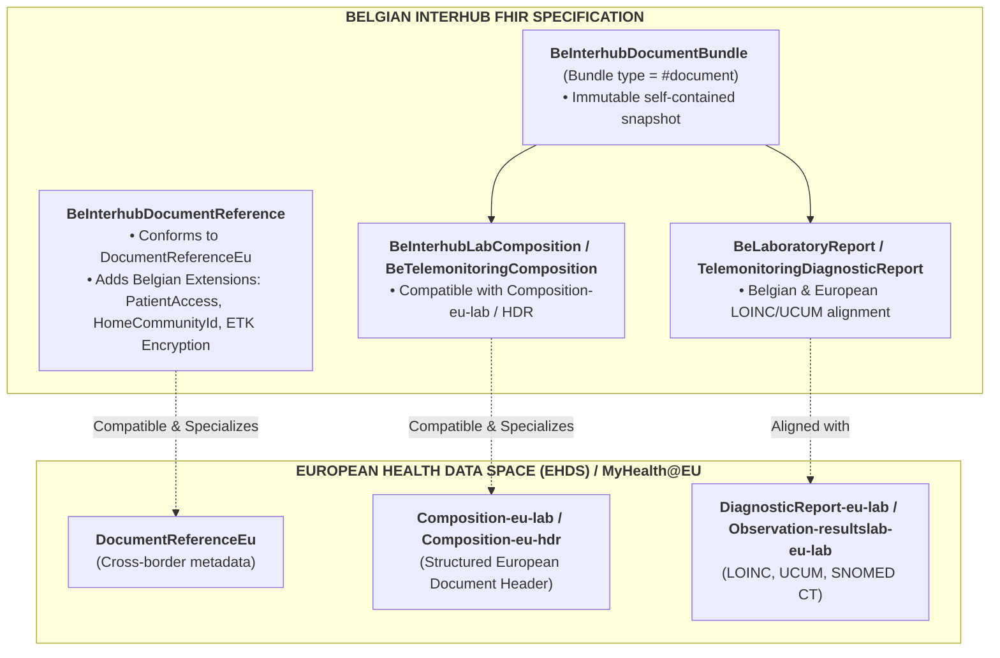
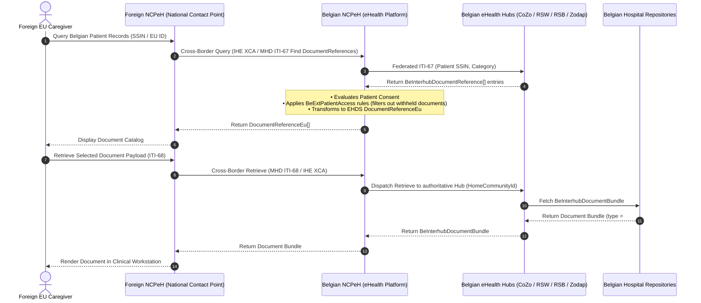

# European Health Data Space (EHDS) Alignment & Interoperability

## 1. Context & Strategic Alignment

The **European Health Data Space (EHDS)** regulation establishes common standards, technical architectures, and interoperability profiles for cross-border primary use of health data across EU Member States (**MyHealth@EU / eHDSI**). Key priority clinical domains defined by the European Commission and HL7 Europe include:
* **Laboratory Results (EU Lab)**: Laboratory test reports, panels, observations, and specimens.
* **Hospital Discharge Reports (EU HDR)**: Episode summaries and hospitalization reports.
* **Patient Summaries (EU PS)**: Core longitudinal health summaries.
* **Medical Imaging Studies (EU Imaging / MADO)**: DICOM manifest studies and imaging reports.
* **ePrescription & eDispensation (EU eP/eD)**: Pharmaceutical prescriptions and dispensing records.

A primary requirement of the Belgian Interhub modernization initiative is to ensure **strict alignment and semantic compatibility with EHDS profiles**, while preserving the advanced governance, federated routing, and privacy controls established in the Belgian healthcare system.

---

## 2. Structural Alignment: Belgian Interhub vs. EHDS Profiles

### 2.1 Profile Alignment Matrix

| EHDS Profile / Element | Belgian Interhub Profile / Element | Interoperability & Conformance Notes |
| :--- | :--- | :--- |
| **`DocumentReferenceEu`** | **`BeInterhubDocumentReference`** | `BeInterhubDocumentReference` satisfies all mandatory elements of `DocumentReferenceEu` (subject, status, docStatus, type, category, date, author, attachment). It adds Belgian-specific extensions for `homeCommunityId`, `patientAccess`, and `recordDateTime`. |
| **`Composition-eu-lab`** | **`BeInterhubLabComposition`** | Both profiles require LOINC `11502-2` ("Laboratory report"), mandatory patient subject, author attribution, and structured narrative sections containing laboratory observation entries. |
| **`DiagnosticReport-eu-lab`** | **`BeLaboratoryReport`** (HL7 Belgium) | Sliced category containing `v2-0074#LAB`, mandatory `code`, `performer`, `issued`, and referenced `Observation` and `Specimen` resources. |
| **`Observation-resultslab-eu-lab`** | **`BeObservationLaboratory`** / Core Observation | Standard LOINC test coding, UCUM unit representation, and reference ranges. |
| **`Document Bundle (type = document)`** | **`BeInterhubDocumentBundle`** | Both architectures mandate that structured documents are exchanged as **self-contained FHIR Bundles of type `document`**, rooted by a `Composition`. |

---

## 3. Belgian Advancements Beyond Baseline EHDS

While maintaining 100% downstream compatibility with EHDS cross-border exchange, the Belgian Interhub system includes advanced national capabilities required for day-to-day healthcare delivery:

### 3.1 Federated Multi-Hub Routing (`homeCommunityId`)
* **EHDS**: Typically models exchanges through a single National Contact Point for eHealth (NCPeH) per Member State.
* **Belgium**: Operates a federated multi-hub network (CoZo, RSW, RSB, Zodap, Metahub). The Belgian profile incorporates `BeExtHomeCommunityId` and `repositoryUniqueId` to support distributed multi-hub queries, deduplication, and direct peer-to-peer document retrieval.

### 3.2 Granular Patient Access Governance (`BeExtPatientAccess`)
* **EHDS**: Patient access is generally handled out-of-band at the portal level.
* **Belgium**: Metadata explicitly encodes patient portal visibility permissions (`yes`, `no`, `never`), release delay dates (`accessDate`), and clinical withholding justifications (`deniedReason`), enforcing Belgian patient rights legislation directly within the metadata layer.

### 3.3 End-to-End Application Encryption (ETEE / ETK Depot)
* **EHDS**: Primarily relies on transport-layer security (TLS) between gateways.
* **Belgium**: Supports payload-level end-to-end encryption using the recipient's public key from the national eHealth ETK Depot (`BeExtEndToEndEncryption`), ensuring document confidentiality across untrusted intermediaries.

### 3.4 Strict Document Typing (`Bundle.type = #document`)
* **EHDS**: Allows various exchange modalities (FHIR documents, RESTful searches on individual resources, CDA XML).
* **Belgium**: Standardizes Interhub sharing strictly on **FHIR Bundles of type `document`** (`MHD ITI-68`), ensuring complete clinical immutability, attestability, and ease of archiving.

---

## 4. Cross-Border Gateway Translation (MyHealth@EU $\longleftrightarrow$ Belgian Hubs)

When a foreign European healthcare provider queries for a Belgian patient's records via MyHealth@EU:

1. The Belgian NCPeH receives the cross-border query and performs an Interhub `getTransactionList` (MHD ITI-67) search across Belgian eHealth hubs.
2. The regional hubs return `BeInterhubDocumentReference` entries.
3. The Belgian NCPeH validates patient consent, filters out documents marked `PatientAccess = never` or sealed, strips internal Belgian-only routing extensions if necessary, and serves the compliant `BeInterhubDocumentBundle` payload to the foreign healthcare provider.
