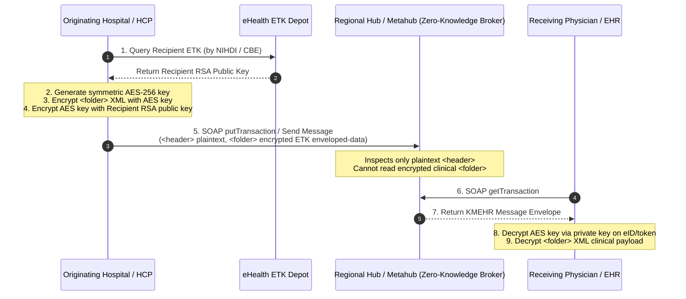
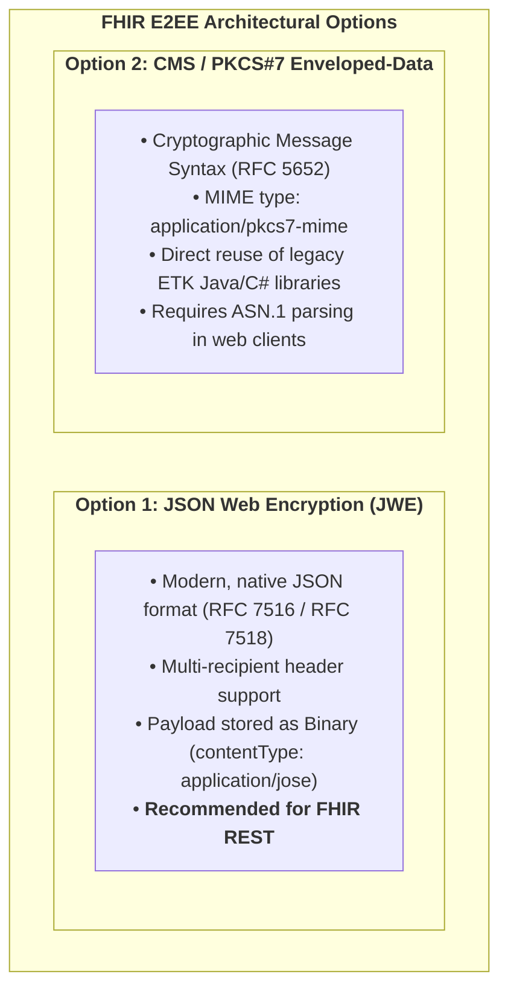
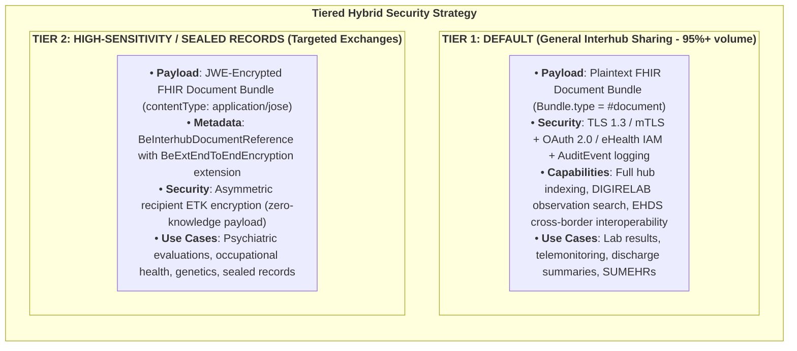

# Architectural Discussion: End-to-End Encryption (E2EE) in FHIR Interhub Sharing

## 1. Executive Summary & Discussion Context

In the legacy Belgian **KMEHR** ecosystem, **End-to-End Encryption (ETEE)** was a defining architectural feature for sensitive clinical data exchange. When sending medical transactions across regional hubs or via the eHealthBox, the originating system encrypted the `<folder>` payload using the recipient's public key retrieved from the national **eHealth ETK (Encryption Token Key) Depot**. Regional hubs and the Metahub acted as "zero-knowledge" routing brokers, inspecting only the unencrypted XML `<header>` and `<transactionSummary>` while remaining incapable of reading the underlying clinical content.

As Belgium transitions to **HL7® FHIR® R4** and the **IHE MHD** profile family, this architectural paper addresses a fundamental question:

> **Should Belgium continue doing End-to-End Payload Encryption in the FHIR Interhub world, and if so, how would it look and what are the trade-offs?**

---

## 2. How KMEHR ETEE Used to Work



---

## 3. How Would End-to-End Encryption Look in the FHIR World?

If application-layer payload encryption is retained in FHIR Interhub sharing, two concrete technical mechanisms can be implemented:



### 3.1 Option 1: JSON Web Encryption (JWE - RFC 7516) *(Recommended for FHIR)*

In a FHIR-native environment, JWE provides an elegant, JSON-based payload encryption standard:
1. The originating system serializes the complete FHIR Document Bundle (`Bundle.type = #document`).
2. The JSON string is encrypted into a **JWE (RFC 7516)** compact or general JSON serialization using AES-GCM (e.g. `A256GCM`) with the recipient's public key (RSA-OAEP-256 or ECDH-ES) fetched from the eHealth ETK depot.
3. The encrypted JWE is stored as a FHIR **`Binary`** resource (`contentType = application/jose`) or embedded inside the `BeInterhubDocumentReference.content.attachment.data`.

#### Structure in `BeInterhubDocumentReference`:
```json
{
  "resourceType": "DocumentReference",
  "id": "docref-encrypted-example-01",
  "meta": {
    "profile": [
      "https://www.ehealth.fgov.be/standards/fhir/interhub/StructureDefinition/be-interhub-documentreference"
    ]
  },
  "extension": [
    {
      "url": "https://www.ehealth.fgov.be/standards/fhir/interhub/StructureDefinition/be-ext-end-to-end-encryption",
      "extension": [
        { "url": "actorId", "valueString": "19876543201" },
        { "url": "actorType", "valueCode": "NIHII" },
        { "url": "keyId", "valueString": "ETK-2026-UZL-091" }
      ]
    }
  ],
  "status": "current",
  "category": [
    {
      "coding": [
        {
          "system": "https://www.ehealth.fgov.be/standards/fhir/core/CodeSystem/cd-transaction",
          "code": "note",
          "display": "Clinical Note"
        }
      ]
    }
  ],
  "subject": {
    "identifier": {
      "system": "https://www.ehealth.fgov.be/standards/fhir/core/NamingSystem/ssin",
      "value": "79080412345"
    }
  },
  "content": [
    {
      "attachment": {
        "contentType": "application/jose",
        "url": "https://hub.cozo.be/fhir/Binary/binary-jwe-payload-01",
        "title": "Encrypted Clinical Consultation Note"
      },
      "format": {
        "system": "https://www.ehealth.fgov.be/standards/fhir/interhub/CodeSystem/be-cs-interhub-format-codes",
        "code": "urn:be:fgov:ehealth:etee:jwe:1.0",
        "display": "Belgian JWE-Encrypted FHIR Document Bundle"
      }
    }
  ]
}
```

### 3.2 Option 2: CMS / PKCS#7 (`application/pkcs7-mime`)

Alternatively, the FHIR Document Bundle is encoded into a standard ASN.1 Cryptographic Message Syntax (CMS / PKCS#7) enveloped-data structure using the recipient's X.509 certificate from the ETK depot.
* **MIME Type**: `application/pkcs7-mime`.
* **Advantage**: Reuses existing eHealth Java/C# cryptographic libraries without modification.
* **Disadvantage**: Binary ASN.1 format requires custom parsing in modern web/JavaScript-based EHR clients.

---

## 4. Architectural Analysis: Should Belgium Continue E2EE in FHIR?

To make an informed national decision, we must evaluate the trade-offs between **Zero-Knowledge Payload Encryption** and **Transport-Layer Security (TLS 1.3 / mTLS) + Authorization Layer Controls**:

| Dimension | Model A: E2EE Payload Encryption (KMEHR / JWE Zero-Knowledge) | Model B: Transport Security (mTLS) + OAuth 2.0 (Standard FHIR/EHDS) |
| :--- | :--- | :--- |
| **1. Intermediary Hub Trust** | Zero-knowledge; hubs cannot read data | Hubs can process plaintext data |
| **2. Search & Indexing** | Metadata only; no payload querying | Deep querying on Observations |
| **3. Clinical Decision Support** | Impossible at hub/gateway level | Fully supported |
| **4. Multi-Disciplinary Care** | High complexity (multi-key management) | Simple (Role & link-based auth) |
| **5. EHDS Cross-Border Interop** | Incompatible without central decrypt | 100% natively compatible |
| **6. Tooling & Ecosystem** | Requires custom cryptographic plugins | Standard FHIR parsers & apps |

### 4.1 Detailed Breakdown of Challenges with E2EE in FHIR:

1. **Loss of Discrete Querying & Indexing (e.g. DIGIRELAB)**:
   * Under the Belgian **DIGIRELAB Phase 3** vision, clinicians and applications need to query specific lab observations across time (e.g., `GET /Observation?code=1558-6&patient.identifier=...`).
   * If document bundles are encrypted end-to-end, hubs cannot index internal observations. Consumers are forced to download and decrypt dozens of full documents to extract a single trend curve.

2. **The "Care Team" Multi-Recipient Dilemma**:
   * KMEHR ETEE worked well for point-to-point mailings (eHealthBox doctor-to-doctor).
   * However, Hub document sharing serves **multidisciplinary care teams**, hospital departments, covering physicians, and emergency rooms.
   * Encrypting a document at publish time requires knowing *every future clinician* who might need to view it—which is impossible for emergency care.

3. **European Health Data Space (EHDS) Incompatibility**:
   * EHDS / MyHealth@EU mandates that National Contact Points (NCPeH) inspect, validate, and mediate standard FHIR Document Bundles across borders.
   * Encrypted JWE/CMS blobs cannot be processed by European gateways without a centralized decryption proxy, defeating the purpose of end-to-end encryption.

4. **Client Tooling Overhead**:
   * Standard SMART on FHIR apps, mobile health apps, and cloud EHRs lack native support for Belgian ETK depot decryption.

---

## 5. Recommended Strategic Solution: The Tiered Hybrid Architecture

Rather than an "all-or-nothing" approach, this Implementation Guide proposes a **Tiered Hybrid Architecture**:



1. **Tier 1 (General Exchange - 95%+ of volume)**:
   * Laboratory results, telemonitoring summaries, discharge letters, and SUMEHRs are exchanged as **plaintext FHIR Document Bundles** over mutually authenticated, encrypted TLS 1.3 connections. Access is strictly controlled by eHealth IAM OAuth tokens, therapeutic link verification, and comprehensive IHE BALP audit logging. This unlocks full clinical querying, AI-assisted decision support, and EHDS cross-border exchange.
2. **Tier 2 (Sensitive / Sealed Consultations)**:
   * For highly sensitive documents intended strictly for a named individual or confidential department, systems use **JWE payload encryption** with the recipient's ETK key. The `BeInterhubDocumentReference` provides the unencrypted discovery metadata, while the `content.attachment.url` delivers the encrypted JWE payload.
