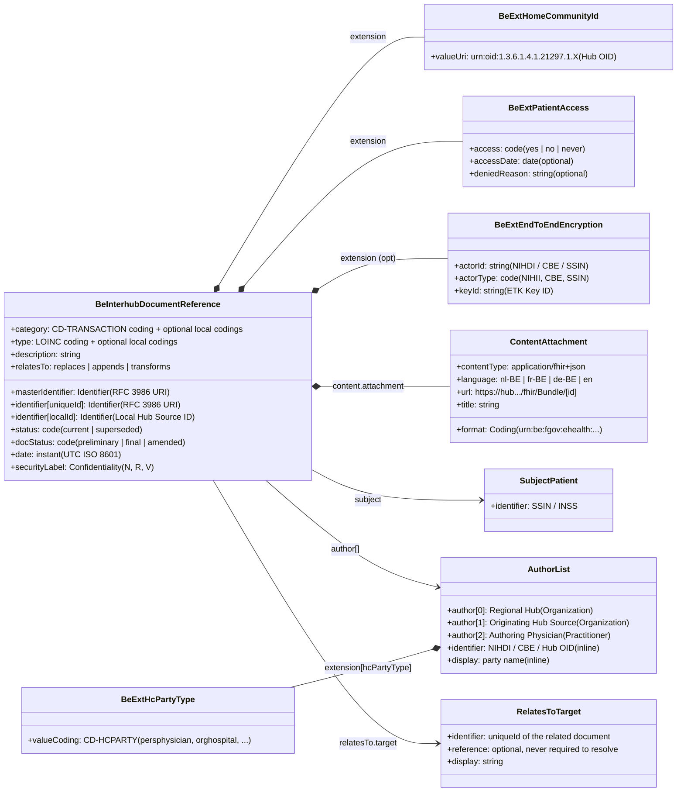

# Document Envelope & Metadata Specification

> **Where this page sits in the guide** — *Specification*, page 1 of 4. This page is the **single source of truth for `BeInterhubDocumentReference`**. Every other page that mentions a metadata field, extension or identifier links back here instead of restating it.
>
> * **Owned by this page:** all `DocumentReference` elements, the four Belgian extensions (`homeCommunityId`, `patientAccess`, `endToEndEncryption`, `recordDateTime`), and the UTC normalization rule.
> * **Not covered here:** how the envelope is queried and returned → [Transactions](transactions.html); who may call and how the call is authenticated → [Security & Authentication](security.html); whether the payload behind `content.attachment.url` should itself be encrypted → [End-to-End Encryption](end-to-end-encryption.html); the KMEHR / XDS.b origin of each field → [KMEHR to FHIR Mapping](mapping-kmehr-to-hub.html).
> * **Previous:** [Design Rationale](resource-considerations.html) · **Next:** [Transactions](transactions.html)

## 1. Overview of the Metadata Model

Discovery and retrieval are strictly separated in Interhub; the reasoning behind that separation is recorded in [Design Rationale §3](resource-considerations.html#3-the-role-of-documentreference-as-discovery-envelope). A client querying for available health records (`getTransactionList`, specified in [Transactions §2](transactions.html#2-transaction-1-gettransactionlist-mhd-iti-67-find-documentreferences)) receives no clinical content at all. What comes back is a lightweight metadata envelope, the **`BeInterhubDocumentReference`**.



This metadata envelope provides:
1. **Clinical Context**: Document category (`CD-TRANSACTION`), precise clinical type (LOINC), clinical encounter period, and confidentiality level.
2. **Author & Institutional Attribution**: Answering hub, originating hub source organisation, and authoring healthcare practitioner.
3. **Retrieval & Routing Endpoints**: The exact RESTful URL to fetch the full FHIR Document Bundle (`type = #document`), accompanied by the repository Home Community ID.
4. **Technical Payload Characteristics**: MIME content type (`application/fhir+json`), document language, and format specification code.
5. **Belgian Governance & Access Rules**: Granular patient portal access permissions, release dates, and end-to-end encryption metadata.

Filled-in examples of this envelope for each supported document type are given in [Laboratory Reports §4](lab-report-sharing.html#4-metadata-mapping-for-gettransactionlist-mhd-iti-67) and [Telemonitoring §4](mapping-telemonitoring-to-hub.html#4-metadata-mapping-for-gettransactionlist-mhd-iti-67).

---

## 2. Element-by-Element Specification (`BeInterhubDocumentReference`)

Every row below is normative for Belgian Interhub exchanges. The legacy KMEHR and IHE XDS.b counterpart of each element — and the transformation logic between them — is listed in [KMEHR to FHIR Mapping §2](mapping-kmehr-to-hub.html#2-master-metadata-mapping-matrix); the search parameters that can be used against these elements are in [Transactions §2.2](transactions.html#22-http-interaction--query-parameters).

| Element | Card. | Type | Description & Belgian Mapping Rule |
| :--- | :--- | :--- | :--- |
| **`masterIdentifier`** | `0..1` | `Identifier` | Globally unique master identifier for this version of the document, formatted as an RFC 3986 URI (e.g., `urn:oid:1.3.6.1.4.1.21297.100.2.1.815933567` or `urn:uuid:...`). |
| **`identifier[uniqueId]`** | `1..1` | `Identifier` | Universal document entry identifier. Must use `system = "urn:ietf:rfc:3986"`. Directly maps to `XDSDocumentEntry.uniqueId` and KMEHR `transactionSummary/id`. |
| **`identifier[localId]`** | `0..*` | `Identifier` | Local identifier assigned by the originating hub source system (hospital EHR, laboratory information system, practice software, …) (e.g. `LAB-2026-03-815933567`). |
| **`status`** | `1..1` | `code` | Metadata lifecycle status: `current` (approved and active), `superseded` (replaced by a newer version), or `entered-in-error`. |
| **`docStatus`** | `0..1` | `code` | Clinical status of the underlying document: `preliminary`, `final`, `amended`. Mapped from KMEHR `iscomplete` / `isvalidated`. |
| **`category[cdTransaction]`** | `1..1` | `CodeableConcept` | Document category. The Belgian `CD-TRANSACTION` coding (`https://www.ehealth.fgov.be/standards/fhir/core/CodeSystem/cd-transaction`, OID `1.3.6.1.4.1.21297.100.3.1`) is **mandatory** — examples: `sumehr`, `labresult`, `discharge`, `telemonitoring`, `note`, `referral`. **Additional codings of the same category from other code systems (local hub source catalogues, regional or LOINC/SNOMED CT equivalents) are explicitly allowed in the same `CodeableConcept`** — see [§4.2](#42-multiple-codings-national-and-local-codes-for-the-same-concept). |
| **`type`** | `1..1` | `CodeableConcept` | Precise clinical document type. At least one coding SHOULD be LOINC (e.g., `11502-2` for Laboratory Report, `18754-2` for Holter Study, `34133-9` for Summarization of Episode) for EHDS compatibility; Belgian national and local document-type codings MAY be carried alongside it in the same `CodeableConcept` ([§4.2](#42-multiple-codings-national-and-local-codes-for-the-same-concept)). |
| **`subject`** | `1..1` | `Reference(BePatient)` | Reference to the patient, as the Belgian federal [`BePatient`](https://www.ehealth.fgov.be/standards/fhir/core/StructureDefinition/be-patient) profile — **not** the plain HL7 `Patient`. The referenced Patient resource must contain the official Belgian Social Security Identification Number (**SSIN / INSS**), and `subject.identifier` SHOULD repeat that SSIN inline so that a search result is usable without resolving the reference ([§4.3](#43-logical-references-identifiers-instead-of-round-trips)). |
| **`date`** | `1..1` | `instant` | Timestamp when the document metadata entry was created/indexed, standardized in **UTC (Z)** format (ISO 8601 `YYYY-MM-DDThh:mm:ssZ`). |
| **`author`** | `1..*` | `Reference(BePractitioner \| BePractitionerRole \| BeOrganization \| Device \| BePatient \| RelatedPerson)` | Sequence of authors, targeting the Belgian federal profiles rather than the HL7 base resources. **The `1..*` cardinality diverges from `BeDocumentReference`, which caps `author` at `1..1` — see [§2.1](#21-relationship-to-bedocumentreference-hl7fhirbecore).** In Belgian Hub rules, author references follow a specific order of granularity: (1) Answering Hub, (2) Originating Hub Source Organisation, (3) Authoring Practitioner / Physician. **Every KMEHR `CD-HCPARTY` party type can be represented** — see the mapping in [§3.5](#35-healthcare-party-type-beexthcpartytype). Each author carries its `CD-HCPARTY` type inline in `author.extension[hcPartyType]`, its business identifier in `author.identifier`, and its name in `author.display`. |
| **`authenticator`** | `0..1` | `Reference(BePractitioner \| BePractitionerRole \| BeOrganization)` | Healthcare party that legally validated / attested the document (KMEHR `isvalidated`). Any `CD-HCPARTY` person, department or organisation type may appear here, typed inline through `authenticator.extension[hcPartyType]` and identified by `authenticator.identifier` (NIHDI / CBE) — [§3.5](#35-healthcare-party-type-beexthcpartytype). |
| **`custodian`** | `0..1` | `Reference(BeOrganization)` | Organization accountable for the long-term maintenance and availability of the document record. This is a `CD-HCPARTY` **organisation** type — `orghospital`, `orglaboratory`, `orgpharmacy`, `orgpractice`, `orgpolyclinic`, `orgretirementhome`, … — a hospital being only one of them ([Architecture §1.2](architecture.html#12-what-counts-as-a-hub-source)). Typed inline through `custodian.extension[hcPartyType]`, identified by `custodian.identifier` (institution NIHDI or CBE). |
| **`relatesTo`** | `0..*` | `BackboneElement` | Explicit relationships to previous documents (`replaces` for amended documents, `appends` for addenda, `transforms`). The related document is identified **by business identifier**: `relatesTo.target.identifier` (`system = "urn:ietf:rfc:3986"`) carries the `uniqueId` of the other document and is **mandatory**; a literal `relatesTo.target.reference` is optional and never required for resolution ([§4.3](#43-logical-references-identifiers-instead-of-round-trips)). |
| **`description`** | `0..1` | `string` | UTF-8 human-readable document title or caption (e.g., *"Comprehensive Blood Biochemistry and Hematology Laboratory Report"*). |
| **`securityLabel`** | `0..*` | `CodeableConcept` | Confidentiality classification from HL7 v3 Confidentiality (`N` = Normal, `R` = Restricted, `V` = Very Restricted / Secret). |
| **`content.attachment.contentType`** | `1..1` | `code` | MIME type of the document payload. For Belgian Interhub document sharing, this is **`application/fhir+json`** (or `application/fhir+xml`). Fallback binary formats like `application/pdf` are also supported. |
| **`content.attachment.language`** | `0..1` | `code` | BCP-47 / RFC 5646 language tag (`nl-BE`, `fr-BE`, `de-BE`, `en`). |
| **`content.attachment.url`** | `1..1` | `url` | Direct RESTful URL to retrieve the full FHIR Document Bundle (MHD ITI-68 retrieve endpoint, e.g. `https://hub.cozo.be/fhir/Bundle/bundle-lab-report-example-01`). |
| **`content.attachment.title`** | `0..1` | `string` | Display title for the attachment. |
| **`content.format`** | `0..1` | `Coding` | Format code identifying the document specification (e.g. `urn:be:fgov:ehealth:lab:document:1.0`, `urn:be:fgov:ehealth:telemonitoring:document:1.0`). |
| **`context.period`** | `0..1` | `Period` | Start and end date/time of the clinical encounter, hospital stay, or telemonitoring monitoring session. |
| **`context.facilityType`** | `0..1` | `CodeableConcept` | Healthcare facility classification (Belgian Facility Type OID `1.3.6.1.4.1.21297.100.4.1`). |
| **`context.practiceSetting`** | `0..1` | `CodeableConcept` | Clinical medical specialty / practice setting (Belgian Practice Setting OID `1.3.6.1.4.1.21297.100.5.1`). |

### 2.1 Relationship to `BeDocumentReference` (hl7.fhir.be.core)

`BeInterhubDocumentReference` is built on the Belgian federal core. Every party it points at is one of the national profiles of [hl7.fhir.be.core](https://www.ehealth.fgov.be/standards/fhir/core/), never the plain HL7 base resource, so a consumer is guaranteed the national identifier slices and the `CD-HCPARTY` typing:

| Envelope element | Target profile | What the profile guarantees |
| :--- | :--- | :--- |
| `subject` | `BePatient` | `identifier[SSIN]` slice bound to the national SSIN/INSS NamingSystem; `BeAddress` line decomposition |
| `author`, `authenticator` | `BePractitioner`, `BePractitionerRole`, `BeOrganization` | `identifier[NIHDI]`, `identifier[SSIN]`, `identifier[CBE]`, `identifier[EHP]` slices; `PractitionerRole.code[CD-HCPARTY]` |
| `custodian` | `BeOrganization` | `identifier[NIHDI]` / `identifier[CBE]` slices; `Organization.type[CD-HCPARTY]` |

This profile also re-applies the other constraints of `BeDocumentReference` — `subject 1..1`, `content.attachment.contentType 1..1`, and the `mustSupport` flags on `category`, `content`, `content.attachment.data`, `content.attachment.url` and `context.related`.

#### Why this profile does not derive from `BeDocumentReference`

`BeInterhubDocumentReference` declares `Parent: DocumentReference` — the HL7 base resource — rather than `Parent: BeDocumentReference`. There is exactly one reason:

> **`BeDocumentReference` constrains `DocumentReference.author` to `1..1`.**

FHIR profiling can only ever *narrow* a cardinality, never widen it. Deriving from `BeDocumentReference` would therefore make the ordered Belgian Hub author chain — answering hub, originating hub source organisation, authoring practitioner — impossible to express, and a `getTransactionList` entry could no longer state both **which hub answered** and **which clinician wrote the document**.

> **Change request against `hl7.fhir.be.core`: `BeDocumentReference.author` SHOULD be relaxed to `1..*`.**
>
> The `1..1` cap is a regression against both of the specifications it sits between:
>
> * **Against KMEHR.** A KMEHR `<transaction>` has always been able to carry several `<author><hcparty>` elements, and Belgian hub traffic routinely does: the hub, the source institution and the physician are three genuinely distinct healthcare parties, and KMEHR names all three. Collapsing them into one loses information that the legacy format already carried — precisely the kind of regression this migration is meant to avoid ([KMEHR to FHIR Mapping](mapping-kmehr-to-hub.html)).
> * **Against HL7.** The base `DocumentReference.author` is `0..*`, and IHE MHD likewise places no upper bound on it. No other national profile of `DocumentReference` known to this IG caps the element at one.
>
> Until that relaxation is published, this IG profiles the base resource and re-applies every other `BeDocumentReference` constraint by hand. The divergence is deliberate, documented in the profile itself, and one-directional: **any instance valid against `BeInterhubDocumentReference` that happens to carry a single author is also valid against `BeDocumentReference`.** Once `hl7.fhir.be.core` allows `author 1..*`, this profile will be re-parented onto `BeDocumentReference` with no other change to the specification.

---

## 3. Belgian Extensions Deep-Dive

### 3.1 Home Community ID (`BeExtHomeCommunityId`)
* **URL**: `https://www.ehealth.fgov.be/standards/fhir/interhub/StructureDefinition/be-ext-home-community-id` (or `urn:ihe:iti:xds:2023:homeCommunityId`)
* **Cardinality**: `1..1` (Mandatory for Interhub exchanges)
* **Value**: `uri` (e.g., `urn:oid:1.3.6.1.4.1.21297.1.3` for CoZo, `urn:oid:1.3.6.1.4.1.21297.1.1` for BHN)
* **Purpose**: Identifies the regional hub responsible for managing the document. Essential for cross-community federation, allowing initiating gateways to route retrieve calls to the correct responding hub. The routing mechanics that consume this value are described in [Architecture §3.2](architecture.html#32-routing-mechanics-via-homecommunityid), and its role in the multi-hub model versus the single-NCP European model in [EHDS Alignment §3.1](ehds-alignment.html#3-belgian-advancements-beyond-baseline-ehds).

### 3.2 Belgian Patient Access Metadata (`BeExtPatientAccess`)
Belgian patients hold a legal right of access to their own medical records through certified national and regional portals such as MaSanté and MijnGezondheid. That right is not unconditional: a physician may delay or withhold a document under therapeutic exception, or until the findings have been discussed face to face.

This extension *carries* the rule; enforcing it is the initiating hub's responsibility, as set out in [Security & Authentication §1.1](security.html#11-trust-model-access-control-is-the-initiating-hubs-responsibility). How it is applied at the European border is described in [EHDS Alignment §3.2](ehds-alignment.html#32-granular-patient-access-governance-beextpatientaccess).

* **URL**: `https://www.ehealth.fgov.be/standards/fhir/interhub/StructureDefinition/be-ext-patient-access`
* **Sub-extensions**:
  1. `access` (`code`, `1..1`, ValueSet: `BeVSPatientAccess`):
     * `yes`: Document is accessible to the patient (subject to optional release date).
     * `no`: Document is temporarily not accessible to the patient. May be released later by the treating physician.
     * `never`: Document is permanently restricted from patient access.
  2. `accessDate` (`date`, `0..1`): Release date (inclusive) after which the document becomes visible on patient portals. Only valid when `access = yes`.
  3. `deniedReason` (`string`, `0..1`): Textual explanation why the document is withheld from the patient (applicable when `access = no` or `never`).

### 3.3 End-to-End Encryption Metadata (`BeExtEndToEndEncryption`)
This extension only *declares* that a payload is encrypted and for whom. Whether Belgium should encrypt FHIR payloads at all, which mechanism to use (JWE or CMS), and the tiered strategy this IG recommends are discussed in [End-to-End Encryption](end-to-end-encryption.html#5-recommended-strategic-solution-the-tiered-hybrid-architecture); the transport-level security that applies to every exchange regardless is specified in [Security & Authentication](security.html).

For cross-enterprise transmissions requiring application-level encryption:
* **URL**: `https://www.ehealth.fgov.be/standards/fhir/interhub/StructureDefinition/be-ext-end-to-end-encryption`
* **Sub-extensions**:
  1. `actorId` (`string`, `1..1`): Identifier of the encryption recipient (NIHDI number, CBE number, or SSIN).
  2. `actorType` (`code`, `1..1`, ValueSet: `BeVSETKEncryptionActor`): `NIHII`, `NIHII-HOSPITAL`, `NIHII-PHARMACY`, `CBE`, `SSIN`, `EHP`.
  3. `applicationId` (`string`, `0..1`): Specific IT application identifier registered in the eHealth ETK depot.
  4. `keyId` (`string`, `0..1`): Encryption Token Key (ETK) identifier.

### 3.4 Source System Recording Timestamp (`BeExtRecordDateTime`)
* **URL**: `https://www.ehealth.fgov.be/standards/fhir/interhub/StructureDefinition/be-ext-record-datetime`
* **Cardinality**: `0..1`
* **Value**: `instant` (UTC ISO 8601)
* **Purpose**: Records the exact timestamp when the document was persisted in the originating hub source system (corresponds to KMEHR `recorddatetime`).

### 3.5 Healthcare Party Type (`BeExtHcPartyType`)
KMEHR carried the nature of every party inline, in `hcparty/cd[@S="CD-HCPARTY"]`. FHIR normally expresses it on the referenced resource instead (`Organization.type`, `PractitionerRole.code`), which would force a consumer to resolve every author of every search result merely to learn whether it is a laboratory, a retirement home or a piece of software. This extension keeps that information **in the envelope**, next to the reference where the consumer already is.

* **URL**: `https://www.ehealth.fgov.be/standards/fhir/interhub/StructureDefinition/be-ext-hcparty-type`
* **Context**: `DocumentReference.author`, `DocumentReference.authenticator`, `DocumentReference.custodian`, `Composition.author`, `Composition.attester.party`, `Composition.custodian`
* **Cardinality**: `0..1` per referenced party (`MS`)
* **Value**: `Coding`, bound **extensible** to the Belgian `CD-HCPARTY` value set (`https://www.ehealth.fgov.be/standards/fhir/core/ValueSet/be-vs-cd-hcparty`, 241 codes, published by HL7 Belgium core)

The complete KMEHR [healthcare party type table](https://www.ehealth.fgov.be/standards/kmehr/en/tables/healthcare-party-type) is supported. Each class of `CD-HCPARTY` code maps onto a FHIR resource as follows:

| `CD-HCPARTY` class | Examples | FHIR resource referenced | Identifier used |
| :--- | :--- | :--- | :--- |
| **Person types** (`pers…`) | `persphysician`, `persnurse`, `persdentist`, `persmidwife`, `persphysiotherapist`, `perspharmacist` | `Practitioner`, or `PractitionerRole` when the role/qualification matters | Practitioner NIHDI (`1.3.6.1.4.1.21297.100.9.1`), SSIN |
| **Organisation types** (`org…`) | `orghospital`, `orglaboratory`, `orgpharmacy`, `orgpractice`, `orgpolyclinic`, `orgretirementhome`, `orgprimaryhealthcarecenter` | `Organization` | Institution NIHDI (`100.11.1`), CBE (`100.11.2`) |
| **Department & specialty types** (`dept…`) | `deptclinicalbiology`, `deptcardiology`, `deptradiology`, `deptemergency` | `Organization` (as `partOf` the parent organisation) or `PractitionerRole.specialty` | Institution NIHDI + local department identifier |
| **Application / system parties** | `application`, `certificateholder` | `Device` (or `Organization` for the hub itself) | Hub Home Community OID, CBE |
| **Patient & related persons** | patient as author, informal caregiver | `Patient`, `RelatedPerson` | SSIN |

```json
"author": [
  {
    "extension": [
      {
        "url": "https://www.ehealth.fgov.be/standards/fhir/interhub/StructureDefinition/be-ext-hcparty-type",
        "valueCoding": {
          "system": "https://www.ehealth.fgov.be/standards/fhir/core/CodeSystem/cd-hcparty",
          "code": "orglaboratory",
          "display": "Independent laboratory"
        }
      }
    ],
    "reference": "Organization/org-lab-example",
    "identifier": {
      "system": "https://www.ehealth.fgov.be/standards/fhir/core/NamingSystem/nihdi",
      "value": "71000012"
    },
    "display": "Klinisch labo Leuven"
  }
]
```

---

## 4. Technical Algorithms & Developer Rules

### 4.1 Timezone Normalization to UTC (Z)
In KMEHR messages, dates and times are often transmitted with local Belgian offsets (CET `+01:00` / CEST `+02:00`) or separated into `<date>` and `<time>` elements. During transformation to FHIR Interhub metadata:
1. Concatenate date and time strings.
2. Apply the correct seasonal timezone offset.
3. Standardize into **UTC ISO 8601 (`YYYY-MM-DDThh:mm:ssZ`)**.

The full set of KMEHR-to-FHIR transformation rules this normalization belongs to is specified in [KMEHR to FHIR Mapping](mapping-kmehr-to-hub.html#2-master-metadata-mapping-matrix).

### 4.2 Multiple Codings: National and Local Codes for the Same Concept

A hub source rarely has only one name for a document. The same discharge report may be `discharge` in `CD-TRANSACTION`, `daghospitalisatieVerslag` in the hospital's own catalogue, and `18842-5` in LOINC. FHIR models this correctly: **one `CodeableConcept` = one concept, carrying as many `Coding` entries as there are code systems that express it.**

**Rule 1 — same concept, several code systems: add codings.** `category[cdTransaction]` and `type` both accept `0..*` additional codings beside the mandatory national one. A hub **MUST NOT** drop local codings when relaying a document to another hub: they are the only way the originating hub source can recognise its own document coming back.

**Rule 2 — different concept: add a separate element.** If the extra code says something else (a second, genuinely different category), it belongs in an additional `category` element, not as an extra coding inside `category[cdTransaction]`.

**Rule 3 — no code at all:** use `category[cdTransaction].text` / `type.text` for the local label; never invent a `CD-TRANSACTION` code that does not exist.

**Rule 4 — searching:** hubs index and match `category` and `type` on **any** coding present. A query on `category=…cd-transaction|discharge` matches the document below, and so does a query on the local system, provided the responding hub knows it.

```json
"category": [
  {
    "coding": [
      {
        "system": "https://www.ehealth.fgov.be/standards/fhir/core/CodeSystem/cd-transaction",
        "code": "discharge",
        "display": "Discharge Report"
      },
      {
        "system": "https://uzleuven.be/fhir/CodeSystem/document-category",
        "code": "daghospitalisatieVerslag",
        "display": "Daghospitalisatie - ontslagverslag"
      }
    ],
    "text": "Ontslagverslag daghospitalisatie"
  }
]
```

### 4.3 Logical References: Identifiers Instead of Round-Trips

A `getTransactionList` response can hold hundreds of entries. Were each entry to carry nothing but literal references (`"reference": "Organization/1234"`), a consumer would owe one extra request per author, per custodian and per related document, spread across a federated network of hubs. That is the classic **N+1 query problem**, aggravated here by the fact that the target may live in an entirely different hub.

The Belgian Interhub envelope is therefore designed to be **self-sufficient**: every reference in a `BeInterhubDocumentReference` SHOULD carry enough inline data to be displayed, filtered and matched without dereferencing.

| Element | Inline data that MUST/SHOULD be present |
| :--- | :--- |
| `subject` | `subject.identifier` = patient SSIN / INSS (SHOULD) |
| `author` | `author.identifier` (NIHDI / CBE / hub OID), `author.display`, `author.extension[hcPartyType]` (SHOULD) |
| `authenticator`, `custodian` | `identifier`, `display`, `extension[hcPartyType]` (SHOULD) |
| `relatesTo.target` | `relatesTo.target.identifier` = `uniqueId` of the related document (**SHALL**, `1..1`) |

For `relatesTo` this is normative rather than advisory: `relatesTo.target.identifier` is mandatory and uses `system = "urn:ietf:rfc:3986"` with the related document's `uniqueId` as value — the very same value a consumer would use in a subsequent `getTransaction` call. A literal `relatesTo.target.reference` MAY be added as a convenience, but a consumer **MUST NOT** be required to dereference it, and a responding hub **MUST NOT** rely on the consumer doing so.

```json
"relatesTo": [
  {
    "code": "replaces",
    "target": {
      "identifier": {
        "system": "urn:ietf:rfc:3986",
        "value": "urn:oid:1.3.6.1.4.1.21297.100.2.1.815933566"
      },
      "display": "Preliminary laboratory report of 2026-03-15 08:40"
    }
  }
]
```

This is the FHIR-sanctioned *logical reference* pattern (`Reference.identifier` without `Reference.reference`): the relationship is fully expressed by identity, and resolving it is a choice the consumer makes when the user actually asks for the previous version.

---

## Continue reading

* **Previous:** [Design Rationale](resource-considerations.html) — why discovery metadata is decoupled from the payload.
* **Next:** [Transactions](transactions.html) — how this envelope is searched (ITI-67) and how the payload it points to is retrieved (ITI-68).
* **Related:** [KMEHR to FHIR Mapping](mapping-kmehr-to-hub.html#2-master-metadata-mapping-matrix) for the legacy origin of every element; [Laboratory Reports](lab-report-sharing.html#4-metadata-mapping-for-gettransactionlist-mhd-iti-67) and [Telemonitoring](mapping-telemonitoring-to-hub.html#4-metadata-mapping-for-gettransactionlist-mhd-iti-67) for filled-in examples; [End-to-End Encryption](end-to-end-encryption.html) for the debate behind the `BeExtEndToEndEncryption` extension.
