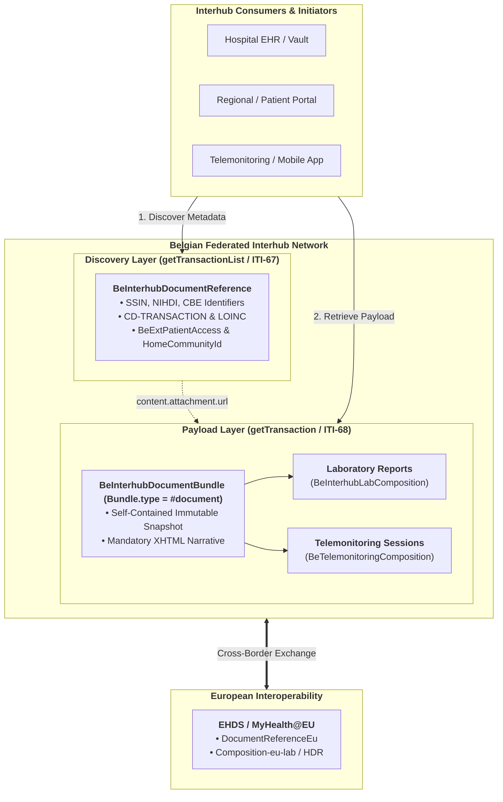

# Belgian Interhub FHIR Document Sharing Implementation Guide

## 1. Executive Summary & Context

In Belgium, the exchange of patient health records between hospitals, private practices, and national registers has historically relied on the **KMEHR** (Kind Messages for Electronic Healthcare Records) XML messaging standard and SOAP-based Interhub Web Services. KMEHR has served our country remarkably well and stands as the best thing that happened in our national sharing infrastructure, establishing a robust foundation for federated clinical data exchange. The Belgian health data sharing landscape is organized around a federated **Hub and Metahub** infrastructure, connecting regional eHealth hubs (such as **CoZo** (Collaboratief Zorgplatform), **RSW** (Réseau Santé Wallon), **RSB** (Réseau Santé Bruxellois), and **Zodap** (Zorg Data Platform)) and connected healthcare repositories.

As hubs we should consider modernizing away from KMEHR SOAP toward **HL7® FHIR® Release 4**, specifically adopting the **IHE MHD (Mobile access to Health Documents)** profile family. This transition allows us to future-proof our infrastructure and enable the next generation of integrators and software developers to remain relevant. It facilitates cloud-native EHR integration, enables mobile and patient-facing applications, and aligns Belgian infrastructure with the **European Health Data Space (EHDS)** framework.

This Implementation Guide (IG) defines the normative **migration proposal and technical specification** for Belgian Interhub communications, providing a complete bridge between established KMEHR services and RESTful FHIR MHD transactions while guaranteeing backwards compatibility and semantic fidelity.

---

## 2. Core Architectural Principles

1. **Document-Centric Sharing**:
   The Belgian Interhub infrastructure is fundamentally a **document sharing infrastructure**. In accordance with national architecture decisions, structured clinical payloads are exchanged as **FHIR Bundles of type `document`** (`Bundle.type = #document`). Each document bundle contains a root `Composition` resource (providing document metadata, authorship, and human-readable narrative sections) followed by all discrete clinical resources (e.g. `DiagnosticReport`, `Observation`, `Specimen`, `Device`, `CarePlan`, `Patient`, `Practitioner`, `Organization`). In addition, the infrastructure fully supports the sharing of **PDF files**, **DICOM files**, and other **pre-existing KMEHR documents** for backwards compatibility.

2. **Decoupled Metadata Discovery Envelope (`DocumentReference`)**:
   Document discovery across the federated hubs is powered by the **`BeInterhubDocumentReference`** profile. This metadata envelope provides the modern equivalent of the KMEHR `TransactionSummaryType` and ebXML RIM `XDSDocumentEntry`, carrying essential discovery parameters, Belgian national identifiers (SSIN/INSS, NIHDI, CBE), Belgian patient access rules, and endpoint URIs for retrieving the document payload.

3. **Interhub Transactions & Operations**:
   * **`getTransactionList`** is mapped directly to **IHE MHD ITI-67 (`Find DocumentReferences`)**, allowing consumers to query for available document metadata summaries matching patient identity and filter criteria.
   * **`getTransaction`** is mapped directly to **IHE MHD ITI-68 (`Retrieve Document`)** and the FHIR `$document` operation, returning the complete immutable FHIR Document Bundle (`type = #document`) or binary/encapsulated document.

4. **EHDS (European Health Data Space) Alignment**:
   The Belgian Interhub profiles are designed to align with EHDS cross-border specifications (such as **EU Laboratory Results**, **EU Hospital Discharge Reports**, **EU Patient Summaries**, and **EU Imaging**). While the Belgian system supports richer federated routing, consent registers, and patient access controls than baseline EHDS, all shared structures maintain bidirectional compatibility with European specifications.

5. **Key Domain Coverage**:
   * **Laboratory Reports (`labresult`)**: Full specification for laboratory report document bundles conforming to HL7 Belgium `BeLaboratoryReport` and EHDS `Composition-eu-lab`.
   * **Telemonitoring (`telemonitoring`)**: Specification for remote patient monitoring sessions, holter studies, carepaths, and telemonitoring diagnostic reports.

---

## 3. Guide Navigation & Table of Contents

The specification is structured into the following normative and informative sections:

| Section | Description |
| :--- | :--- |
| **[Architecture & Interhub Ecosystem](architecture.html)** | Overview of the Belgian Hub/Metahub network, regional eHealth hubs, federated routing, and dual-stack gateway architecture. |
| **[Envelope & Metadata Specification](envelope-and-metadata.html)** | Deep-dive into `BeInterhubDocumentReference`, national identifiers, Belgian patient access metadata, ETK encryption, and MIME requirements. |
| **[Interhub Transactions & Operations](transactions.html)** | Formal technical specification of `getTransactionList` (MHD ITI-67) and `getTransaction` (MHD ITI-68) operations. |
| **[Interhub Security Architecture](security.html)** | Specification of the 3 authentication routes, mTLS, DPoP (RFC 9449) / RFC 9421 tamper-proofing, SMART on FHIR scopes, and IHE BALP auditing. |
| **[End-to-End Encryption Discussion Paper](end-to-end-encryption.html)** | Architectural analysis of KMEHR ETEE vs FHIR E2EE, JWE/CMS payload encryption, zero-knowledge hubs, and the recommended hybrid strategy. |
| **[KMEHR to FHIR Mapping Matrix](mapping-kmehr-to-hub.html)** | Comprehensive normative field-by-field crosswalk between KMEHR XML schemas, IHE XDS.b ebXML, and FHIR MHD resources. |
| **[EHDS Alignment & Interoperability](ehds-alignment.html)** | Detailed analysis of alignment with European Health Data Space (EHDS) profiles and MyHealth@EU cross-border exchange. |
| **[Laboratory Report Sharing](lab-report-sharing.html)** | End-to-end specification for sharing Laboratory Reports as FHIR Document Bundles. |
| **[Telemonitoring Document Sharing](mapping-telemonitoring-to-hub.html)** | End-to-end specification for sharing Telemonitoring and remote patient monitoring sessions as FHIR Document Bundles. |
| **[Architectural & Resource Considerations](resource-considerations.html)** | Rationale for architectural decisions, document immutability, and resource selection. |
| **[Artifacts Summary](artifacts.html)** | Comprehensive directory of all FHIR Profiles, Extensions, Value Sets, Code Systems, Capability Statements, and Examples. |

---

## 4. Key Artifacts Overview

* **Profiles**:
  * `BeInterhubDocumentReference`: Metadata discovery envelope for search results (`getTransactionList`).
  * `BeInterhubDocumentBundle`: Canonical FHIR Document Bundle (`type = #document`) for document retrieval (`getTransaction`).
  * `BeInterhubLabComposition`: Root Composition for Laboratory Reports.
  * `BeTelemonitoringComposition`: Root Composition for Telemonitoring and remote monitoring sessions.
  * `TelemonitoringDiagnosticReport`: DiagnosticReport profile carrying telemonitoring session parameters and results.
* **Extensions**:
  * `BeExtPatientAccess`: Belgian patient access permissions (`yes`, `no`, `never`), release dates, and withholding reasons.
  * `BeExtHomeCommunityId`: Hub Home Community ID for cross-hub routing.
  * `BeExtEndToEndEncryption`: Belgian eHealth ETK depot encryption metadata for end-to-end secure transmission.
  * `BeExtRecordDateTime`: Source repository recording timestamp.
  * `TelemonitoringId`, `Carepath`, `PrescriberApplication`, `SourceTelemonitoringReport`: Telemonitoring metadata extensions.
* **Capability Statements**:
  * `BeInterhubDocumentResponder`: Server requirements for eHealth Hubs and Document Registries/Repositories.
  * `BeInterhubDocumentConsumer`: Client requirements for EHRs, regional portals, and initiating eHealth hubs.
