# KMEHR to FHIR MHD Interhub Mapping Matrix

> **Where this page sits in the guide** — *Migration & Alignment*, page 1 of 2. This is the crosswalk that makes the dual-stack gateway of [Architecture §4](architecture.html#4-dual-stack-gateway-architecture-transition-phase) implementable. Read it when you are migrating an existing KMEHR connector, not when you are learning the target model.
>
> * **Owned by this page:** KMEHR ↔ IHE XDS.b ↔ FHIR field mappings, code-system crosswalks, and the KMEHR encapsulation strategy for the transition period.
> * **The target definitions live elsewhere:** the FHIR elements in the right-hand columns are specified in [Envelope & Metadata](envelope-and-metadata.html); the SOAP operations being replaced are specified in [Transactions](transactions.html).
> * **Previous:** [Telemonitoring](mapping-telemonitoring-to-hub.html) · **Next:** [EHDS Alignment](ehds-alignment.html)

## 1. Executive Summary & Mapping Scope

This specification provides the normative, bi-directional mapping between legacy Belgian **KMEHR** XML messages (used in SOAP Interhub Web Services such as `getTransactionList` and `getTransaction`), intermediate **IHE XDS.b / XCA** constructs, and the target **HL7® FHIR® R4 / IHE MHD** profiles.

```mermaid
flowchart LR
    subgraph KMEHR["<b>Legacy Belgian KMEHR</b>"]
        direction TB
        K1["TransactionSummaryType / id"]
        K2["folder / patient / id (INSS)"]
        K3["transaction / cd (CD-TRANSACTION)"]
        K4["transaction / author / hcparty"]
        K5["transaction / lnk (multimedia)"]
    end

    subgraph XDS["<b>IHE XDS.b / XCA</b>"]
        direction TB
        X1["XDSDocumentEntry.uniqueId"]
        X2["XDSDocumentEntry.patientId"]
        X3["XDSDocumentEntry.classCode"]
        X4["authorInstitution / authorPerson"]
        X5["ExtrinsicObject / mimeType"]
    end

    subgraph FHIR["<b>HL7 FHIR R4 / IHE MHD</b>"]
        direction TB
        F1["BeInterhubDocumentReference<br/>• masterIdentifier / uniqueId<br/>• extension[homeCommunityId]"]
        F2["subject (Patient with SSIN)"]
        F3["category[cdTransaction] & type (LOINC)"]
        F4["author[0..2] (Hub, Org, Practitioner)"]
        F5["BeInterhubDocumentBundle<br/>(Bundle.type = #document)"]
    end

    KMEHR <-->|"ebXML Transformation"| XDS
    XDS <-->|"MHD Profile Mapping"| FHIR
    KMEHR <===>|"Direct Interhub Mapping"| FHIR
```



The mapping encompasses:
1. **Metadata Envelope Mapping**: `TransactionSummaryType` $\longleftrightarrow$ `XDSDocumentEntry` $\longleftrightarrow$ `BeInterhubDocumentReference`.
2. **Payload Encapsulation Mapping**: KMEHR `<folder>/<transaction>` $\longleftrightarrow$ `BeInterhubDocumentBundle` (`Bundle.type = #document`).
3. **Terminology & Code System Crosswalks**: Belgian national code tables (`CD-TRANSACTION`, `CD-HCPARTY`, `CD-CONFIDENTIALITY`, `CD-SEX`).

This page maps *between* representations; it does not define the target. The FHIR elements in the right-hand columns below are specified in [Envelope & Metadata](envelope-and-metadata.html#2-element-by-element-specification-beinterhubdocumentreference), the RESTful operations replacing the SOAP services in [Transactions](transactions.html), and the runtime component that applies these mappings — the dual-stack gateway — in [Architecture §4](architecture.html#4-dual-stack-gateway-architecture-transition-phase).

---

## 2. Master Metadata Mapping Matrix

| Concept | KMEHR Schema Element (`getTransactionList` / `getTransaction`) | IHE XDS.b ebXML RIM 3.0 Attribute / Slot | FHIR MHD (`BeInterhubDocumentReference`) Element | FHIR Datatype & Syntax | Transformation Logic & Notes |
| :--- | :--- | :--- | :--- | :--- | :--- |
| **Document Unique ID** | `transaction/id[@S="ID-KMEHR"]`<br>or `transactionSummary/id` | `XDSDocumentEntry.uniqueId` (`externalIdentifier` `urn:uuid:2e82c1f6...`) | `masterIdentifier`<br>and `identifier[uniqueId]` | `Identifier` (`system = "urn:ietf:rfc:3986"`) | Prefix with `urn:oid:` or `urn:uuid:` to form a valid RFC 3986 URI. |
| **Local Repository ID** | `transaction/id[@SL]` or source local ID | Local entry ID in repository | `identifier[localId]` | `Identifier` | Internal record number in the hub source system. |
| **Home Community ID** | Metahub header `hub/id` or `id[@SL]` | `XDSDocumentEntry.homeCommunityId` (`ExtrinsicObject/@home`) | `extension[homeCommunityId]` | `Extension(valueUri)` | Registered Hub OID as URI (e.g. `urn:oid:1.3.6.1.4.1.21297.1.3`). Mandatory for cross-hub routing. |
| **Repository Unique ID** | Routing key / Repository OID | `XDSDocumentEntry.repositoryUniqueId` (`Slot name="repositoryUniqueId"`) | `custodian.identifier` | `Identifier` | Identifies the physical repository of the hub source (`1.3.6.1.4.1.21297.100.2.X`). |
| **Patient Identifier (SSIN)** | `folder/patient/id[@S="INSS"]` | `XDSDocumentEntry.patientId` (`externalIdentifier` `urn:uuid:58a7...`) | `subject` $\rightarrow$ `Patient.identifier` | `Identifier` | `system = "https://www.ehealth.fgov.be/standards/fhir/core/NamingSystem/ssin"` and `value = INSS`. |
| **Patient Demographics** | `folder/patient/familyname`<br>`folder/patient/firstname`<br>`folder/patient/birthdate`<br>`folder/patient/sex/cd` | `XDSDocumentEntry.sourcePatientInfo` (`Slot name="sourcePatientInfo"` PID lines) | `subject` $\rightarrow$ `Patient` resource | `Resource(Patient)` | Maps name, birthDate, gender (`male`/`female`), and address lines. |
| **Document Category** | `transaction/cd[@S="CD-TRANSACTION"]`<br>(e.g. `sumehr`, `labresult`, `discharge`) | `XDSDocumentEntry.classCode` (`Classification` `urn:uuid:41a5...`) | `category[cdTransaction]` | `CodeableConcept` | `system = "https://www.ehealth.fgov.be/standards/fhir/core/CodeSystem/cd-transaction"` and `code = transaction/cd`. |
| **Document Type Code** | `transaction/cd[@S="CD-CLINICAL"]` | `XDSDocumentEntry.typeCode` (`Classification` `urn:uuid:f030...`) | `type` | `CodeableConcept` | LOINC code (e.g. `11502-2` for Lab Report, `10185-7` for Holter Study). |
| **Document Title / Caption** | `transaction/caption`<br>or `transaction/text` | `XDSDocumentEntry.title` (`rim:Name/rim:LocalizedString`) | `description`<br>and `content.attachment.title` | `string` | UTF-8 human-readable document description. |
| **Document Status** | Document execution status (`iscomplete`, `isvalid`) | `XDSDocumentEntry.availabilityStatus` (`ExtrinsicObject/@status`) | `status` | `code` | Approved $\rightarrow$ `current`<br>Deprecated/Replaced $\rightarrow$ `superseded`. |
| **Document Lifecycle Status** | `iscomplete="false"` $\rightarrow$ preliminary<br>`isvalidated="true"` $\rightarrow$ final | XDS document lifecycle status | `docStatus` | `code` | `preliminary` \| `final` \| `amended`. |
| **Creation Date & Time** | `transaction/date` & `time`<br>or `recorddatetime` | `XDSDocumentEntry.creationTime` (`Slot name="creationTime"`) | `date` | `instant` (ISO 8601 UTC) | Standardized to UTC (`YYYY-MM-DDThh:mm:ssZ`). |
| **Service Period Start** | `transaction/begindate` & `begintime` | `XDSDocumentEntry.serviceStartTime` (`Slot name="serviceStartTime"`) | `context.period.start` | `dateTime` | Timestamp when medical encounter or monitoring started. |
| **Service Period End** | `transaction/enddate` & `endtime` | `XDSDocumentEntry.serviceStopTime` (`Slot name="serviceStopTime"`) | `context.period.end` | `dateTime` | Timestamp when medical encounter or monitoring ended. |
| **Authoring Hub** | Answering Hub identifier in `header/sender` | First `authorInstitution` in XDS | `author[0]` $\rightarrow$ `Organization` | `Reference(Organization)` | Regional hub answering the request (e.g. CoZo). |
| **Authoring Source Organisation** | `author/hcparty` where `cd` is an organisation type (`orghospital`, `orglaboratory`, `orgpharmacy`, `orgpractice`, `orgretirementhome`, …) | `authorInstitution` (HL7 v2 XON) | `author[1]` $\rightarrow$ `Organization` | `Reference(Organization)` | Hub source organisation NIHDI (`100.11.1`) and CBE (`100.11.2`). |
| **Authoring Practitioner** | `author/hcparty` where `cd="persphysician"` | `authorPerson` (HL7 v2 XCN) | `author[2]` $\rightarrow$ `Practitioner` | `Reference(Practitioner)` | Physician NIHDI (`100.9.1`) and full name. |
| **Confidentiality Code** | `transaction/confidentiality/cd` | `XDSDocumentEntry.confidentialityCode` (`Classification` `urn:uuid:f4f8...`) | `securityLabel` | `CodeableConcept` | `normal` $\rightarrow$ `N`, `restricted` $\rightarrow$ `R`, `secret` $\rightarrow$ `V`. |
| **Patient Access Permission** | `transaction/cd[@SL="PatientAccess"]` | Local patient access classification | `extension[patientAccess].access` | `code` (`yes` \| `no` \| `never`) | Patient portal visibility permission. |
| **Patient Access Release Date** | `transaction/cd[@SL="PatientAccessDate"]` | Local patient release date slot | `extension[patientAccess].accessDate` | `date` | Date after which patient may view the document. |
| **Patient Access Denied Reason** | `transaction/cd[@SL="PatientAccessDeniedReasonForPatient"]` | Local withholding explanation slot | `extension[patientAccess].deniedReason` | `string` | Clinical justification for withholding record. |
| **Source Recording Timestamp** | `transaction/recorddatetime` | Source registration timestamp slot | `extension[recordDateTime]` | `instant` (ISO 8601 UTC) | Persist date/time in the hub source system. |
| **MIME Content Type** | `transaction/lnk/@TYPE` | `ExtrinsicObject/@mimeType` | `content.attachment.contentType` | `code` | **`application/fhir+json`** (for FHIR Document Bundles). |
| **Document Format Code** | Schema namespace / transaction format | `XDSDocumentEntry.formatCode` | `content.format` | `Coding` | Coded format URI (e.g. `urn:be:fgov:ehealth:lab:document:1.0`). |
| **Retrieval URL Endpoint** | Internal repository locator | Repository URL endpoint | `content.attachment.url` | `url` | RESTful endpoint to retrieve the `BeInterhubDocumentBundle`. |

---

## 3. Code System & Value Set Crosswalks

### 3.1 Document Category: `CD-TRANSACTION` $\longleftrightarrow$ FHIR Coding

| KMEHR `CD-TRANSACTION` Code | Display Name | Target FHIR `category.coding` |
| :--- | :--- | :--- |
| `sumehr` | Summarized Electronic Health Record | `https://www.ehealth.fgov.be/standards/fhir/core/CodeSystem/cd-transaction#sumehr` |
| `labresult` | Laboratory Result | `https://www.ehealth.fgov.be/standards/fhir/core/CodeSystem/cd-transaction#labresult` |
| `discharge` | Hospital Discharge Summary | `https://www.ehealth.fgov.be/standards/fhir/core/CodeSystem/cd-transaction#discharge` |
| `telemonitoring` | Telemonitoring Report | `https://www.ehealth.fgov.be/standards/fhir/core/CodeSystem/cd-transaction#telemonitoring` |
| `note` | Clinical Contact Note | `https://www.ehealth.fgov.be/standards/fhir/core/CodeSystem/cd-transaction#note` |
| `referral` | Referral Letter | `https://www.ehealth.fgov.be/standards/fhir/core/CodeSystem/cd-transaction#referral` |
| `prescription` | Pharmaceutical Prescription | `https://www.ehealth.fgov.be/standards/fhir/core/CodeSystem/cd-transaction#prescription` |
| `radiology` | Radiology / Imaging Report | `https://www.ehealth.fgov.be/standards/fhir/core/CodeSystem/cd-transaction#radiology` |
| `vaccination` | Vaccination Record | `https://www.ehealth.fgov.be/standards/fhir/core/CodeSystem/cd-transaction#vaccination` |

### 3.2 Confidentiality: `CD-CONFIDENTIALITY` $\longleftrightarrow$ HL7 v3 Confidentiality

These labels are carried as metadata and are interpreted by the **initiating hub**, which owns the access decision; a responding hub returns the label as published and does not enforce it on the initiating hub's behalf.

| KMEHR Confidentiality Value | HL7 v3 Code | Display | Belgian Access Policy (applied by the initiating hub) |
| :--- | :--- | :--- | :--- |
| `normal` / (omitted) | `N` | Normal | No additional restriction beyond the initiating hub's standard access control. |
| `restricted` | `R` | Restricted | The initiating hub restricts disclosure to specialty care providers / explicit therapeutic links. |
| `secret` | `V` | Very Restricted | Sealed document; the initiating hub restricts disclosure to the original author and their delegates. |

---

## 4. Encapsulation Strategy: FHIR Document inside KMEHR (Transition Phase)

During the migration period, legacy systems unable to process native RESTful FHIR interactions can receive FHIR Document Bundles encapsulated inside standard KMEHR messages via `<lnk>` multimedia elements. This is the payload direction of the dual-stack gateway described in [Architecture §4](architecture.html#4-dual-stack-gateway-architecture-transition-phase); the encapsulated bundle itself is a normal `BeInterhubDocumentBundle` as specified in [Transactions §3.3](transactions.html#33-payload-structure-strictly-fhir-bundles-of-type-document):

```xml
<transaction>
    <id S="ID-KMEHR">1.3.6.1.4.1.21297.100.2.1.815933567</id>
    <cd S="CD-TRANSACTION">labresult</cd>
    <date>2026-03-15</date>
    <time>10:30:00</time>
    <author>
        <hcparty>
            <id S="ID-HCPARTY" SV="1.0">10000007999</id>
            <cd S="CD-HCPARTY" SV="1.0">persphysician</cd>
            <firstname>Danièle</firstname>
            <familyname>Govaerts</familyname>
        </hcparty>
    </author>
    <iscomplete>true</iscomplete>
    <isvalidated>true</isvalidated>
    
    <!-- Encapsulated FHIR Document Bundle (Base64-encoded JSON) -->
    <lnk TYPE="multimedia" 
         MEDIATYPE="application/fhir+json">
        ewogICAgInJlc291cmNlVHlwZSI6ICJCdW5kbGUiLAogICAgInR5cGUiOiAiZG9jdW1lbnQiLA...
    </lnk>
</transaction>
```

---

## Continue reading

* **Previous:** [Telemonitoring](mapping-telemonitoring-to-hub.html) — the second of the two document types being mapped.
* **Next:** [EHDS Alignment](ehds-alignment.html) — the outward-facing equivalent of this page: how the Belgian model maps onto European cross-border profiles.
* **Related:** [Architecture §4](architecture.html#4-dual-stack-gateway-architecture-transition-phase) for the gateway that applies these mappings at runtime; [Envelope & Metadata](envelope-and-metadata.html) for the normative definition of every target element; [Transactions §4](transactions.html#4-error-codes--exception-crosswalk) for the SOAP fault to HTTP status crosswalk.
