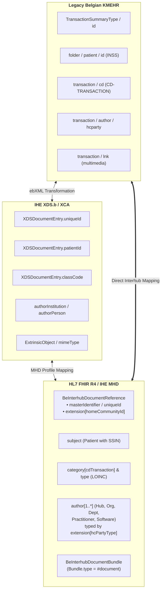

# KMEHR to FHIR MHD Interhub Mapping Matrix

> **Where this page sits in the guide** — *Migration & Alignment*, page 1 of 2. This is the crosswalk that makes the dual-stack gateway of [Architecture §4](architecture.html#4-dual-stack-gateway-architecture-transition-phase) implementable. Read it when you are migrating an existing KMEHR connector, not when you are learning the target model.
>
> * **Owned by this page:** KMEHR ↔ IHE XDS.b ↔ FHIR field mappings, code-system crosswalks, and the KMEHR encapsulation strategy for the transition period.
> * **The target definitions live elsewhere:** the FHIR elements in the right-hand columns are specified in [Envelope & Metadata](envelope-and-metadata.html); the SOAP operations being replaced are specified in [Transactions](transactions.html).
> * **Previous:** [Telemonitoring](mapping-telemonitoring-to-hub.html) · **Next:** [EHDS Alignment](ehds-alignment.html)

## 1. Executive Summary & Mapping Scope

This page holds the normative, bi-directional mapping between three representations of the same information: legacy Belgian **KMEHR** XML as used in the SOAP Interhub Web Services (`getTransactionList`, `getTransaction`), the intermediate **IHE XDS.b / XCA** constructs, and the target **HL7® FHIR® R4 / IHE MHD** profiles.



The mapping encompasses:
1. **Metadata Envelope Mapping**: `TransactionSummaryType` ↔ `XDSDocumentEntry` ↔ `BeInterhubDocumentReference`.
2. **Payload Encapsulation Mapping**: KMEHR `<folder>/<transaction>` ↔ `BeInterhubDocumentBundle` (`Bundle.type = #document`).
3. **Terminology & Code System Crosswalks**: Belgian national code tables (`CD-TRANSACTION`, `CD-HCPARTY`, `CD-CONFIDENTIALITY`, `CD-SEX`).

This page maps *between* representations; it does not define the target. The FHIR elements in the right-hand columns below are specified in [Envelope & Metadata](envelope-and-metadata.html#2-element-by-element-specification-beinterhubdocumentreference), the RESTful operations replacing the SOAP services in [Transactions](transactions.html), and the runtime component that applies these mappings — the dual-stack gateway — in [Architecture §4](architecture.html#4-dual-stack-gateway-architecture-transition-phase).

---

## 2. Master Metadata Mapping Matrix

| Concept | KMEHR Schema Element (`getTransactionList` / `getTransaction`) | IHE XDS.b ebXML RIM 3.0 Attribute / Slot | FHIR MHD (`BeInterhubDocumentReference`) Element | FHIR Datatype & Syntax | Transformation Logic & Notes |
| :--- | :--- | :--- | :--- | :--- | :--- |
| **Document Unique ID** | `transaction/id[@S="ID-KMEHR"]` **when the responding hub publishes one**; otherwise `transaction/id[@S="LOCAL"]` together with its `@SL` scheme name — see [§2.1](#21-what-actually-identifies-a-transaction-in-kmehr) | `XDSDocumentEntry.uniqueId` (`externalIdentifier` `urn:uuid:2e82c1f6...`) | `masterIdentifier`<br/>and `identifier[uniqueId]` | `Identifier` (`system = "urn:ietf:rfc:3986"`) | A globally unique transaction id is **not guaranteed** in hub traffic, and consumers must not assume one. Where it is absent, the responding hub **mints** a stable RFC 3986 URI from the composite key *(hub EHP number, `@SL` scheme, `id[@S="LOCAL"]` value)*, and MUST return the same URI for the same transaction on every query. |
| **Message / request ID** | `request/id[@S="ID-KMEHR"]` and `response/id[@S="ID-KMEHR"]` (one per SOAP call) | ebXML message id | *(no document element)* — transport correlation only | `id` | The `ID-KMEHR` id **on the `request`/`response` element** identifies the message, not the document. Map it to the HTTP request correlation id / `Bundle.id` of the searchset, never to `identifier[uniqueId]`. |
| **Local Repository ID & scheme** | `transaction/id[@S="LOCAL"]` value + `@SL` scheme name (e.g. `SL="RADPORTAL"`, `SL="labo"`) | Local entry ID in repository | `identifier` (local slice) — value from the element text, `system` from the `@SL` scheme | `Identifier` | The `@SL` attribute names the *local identifier scheme* of the hub source and is part of the retrieval key: it MUST be preserved and echoed back on retrieval ([§2.1](#21-what-actually-identifies-a-transaction-in-kmehr)). Represent it as a URI derived from the hub EHP number and the scheme name. |
| **Home Community ID** | Metahub header `hub/id` or `id[@SL]` | `XDSDocumentEntry.homeCommunityId` (`ExtrinsicObject/@home`) | `extension[homeCommunityId]` | `Extension(valueUri)` | Registered Hub OID as URI (e.g. `urn:oid:1.3.6.1.4.1.21297.1.3`). Mandatory for cross-hub routing. |
| **Repository Unique ID** | Routing key / Repository OID | `XDSDocumentEntry.repositoryUniqueId` (`Slot name="repositoryUniqueId"`) | `custodian.identifier` | `Identifier` | Identifies the physical repository of the hub source (`1.3.6.1.4.1.21297.100.2.X`). |
| **Patient Identifier (SSIN)** | `folder/patient/id[@S="INSS"]`, falling back to `id[@S="ID-PATIENT"]` when the responding hub does not publish an INSS | `XDSDocumentEntry.patientId` (`externalIdentifier` `urn:uuid:58a7...`) | `subject` → `Patient.identifier` | `Identifier` | `system = "https://www.ehealth.fgov.be/standards/fhir/core/NamingSystem/ssin"` and `value = INSS`. |
| **Patient Demographics** | `folder/patient/familyname`<br/>`folder/patient/firstname`<br/>`folder/patient/birthdate`<br/>`folder/patient/sex/cd` | `XDSDocumentEntry.sourcePatientInfo` (`Slot name="sourcePatientInfo"` PID lines) | `subject` → `Patient` resource | `Resource(Patient)` | Maps name, birthDate, gender (`male`/`female`), and address lines. |
| **Document Category** | `transaction/cd[@S="CD-TRANSACTION"]`<br/>(e.g. `sumehr`, `labresult`, `discharge`)<br/>**plus** `transaction/cd[@S="LOCAL" @SL="…" @DN="…"]` when the hub source publishes its own catalogue code | `XDSDocumentEntry.classCode` (`Classification` `urn:uuid:41a5...`) | `category[cdTransaction]` | `CodeableConcept` | The `CD-TRANSACTION` code becomes the mandatory `coding[cdTransactionCode]` (`system = "https://www.ehealth.fgov.be/standards/fhir/core/CodeSystem/cd-transaction"`). Every `cd[@S="LOCAL"]` becomes an **additional coding** in the same `CodeableConcept`: `@SL` → `coding.system` (as a URI of the publishing hub source), element text → `coding.code`, `@DN` → `coding.display` ([§3.1](#31-document-category-cd-transaction-to-fhir-coding)). |
| **Document Type Code** | *Usually no direct source.* Belgian hub transactions are typed with `cd[@S="CD-TRANSACTION"]` and, where the hub source has one, `cd[@S="LOCAL"]`. `CD-CLINICAL` is an **item-level** KMEHR table and is not the transaction type. | `XDSDocumentEntry.typeCode` (`Classification` `urn:uuid:f030...`) | `type` | `CodeableConcept` | The LOINC coding is normally **derived** by the gateway from `CD-TRANSACTION` (and, where available, the local `cd[@S="LOCAL"]` code) through a national mapping table — e.g. `labresult` → `11502-2`. The local coding is carried alongside it in the same `CodeableConcept`. A hub that cannot derive a LOINC code populates `type.text` only rather than inventing one. |
| **Document Title / Caption** | `transaction/cd[@S="LOCAL"]/@DN`, `transaction/text`, or `transaction/caption` — in that order of practical availability | `XDSDocumentEntry.title` (`rim:Name/rim:LocalizedString`) | `description`<br/>and `content.attachment.title` | `string` | Human-readable label of the document. In practice most Belgian hubs carry it as the `@DN` attribute of the local `cd` element rather than in a caption element, so a gateway SHOULD look there first and fall back to `text` / `caption` and finally to the category display. |
| **Document Status** | Presence of the transaction in the answering hub's index; a revoked transaction disappears from `getTransactionList` | `XDSDocumentEntry.availabilityStatus` (`ExtrinsicObject/@status`) | `status` | `code` | Listed → `current`<br/>Replaced by a newer version → `superseded`. KMEHR has no per-transaction availability flag on the list entry; the hub derives it from its own index. |
| **Document Lifecycle Status** | `transaction/iscomplete` and `transaction/isvalidated` (elements of the transaction itself) | XDS document lifecycle status | `docStatus` | `code` | `iscomplete="false"` → `preliminary`; `iscomplete="true"` + `isvalidated="true"` → `final`. **Do not confuse these with `acknowledge/iscomplete`**, which qualifies the *SOAP response* and maps to an `OperationOutcome` ([Transactions §4](transactions.html#4-error-codes--exception-crosswalk)). |
| **Document Date & Time** | `transaction/date` **and** `transaction/time` (two separate elements, no timezone) | `XDSDocumentEntry.creationTime` (`Slot name="creationTime"`) | `date` | `instant` (ISO 8601 UTC) | Concatenate as `date + "T" + time`, interpret in **Europe/Brussels** local time (CET/CEST) and normalize to UTC. This is the value hub clients sort and range-filter on. |
| **Service Period Start** | `transaction/begindate` & `begintime` | `XDSDocumentEntry.serviceStartTime` (`Slot name="serviceStartTime"`) | `context.period.start` | `dateTime` | Timestamp when medical encounter or monitoring started. |
| **Service Period End** | `transaction/enddate` & `endtime` | `XDSDocumentEntry.serviceStopTime` (`Slot name="serviceStopTime"`) | `context.period.end` | `dateTime` | Timestamp when medical encounter or monitoring ended. |
| **Authoring parties (all of them)** | `transaction/author/hcparty[]` — an **unordered, repeating** list. A single transaction commonly names the answering hub (`cd = hub`), the hub source organisation (`orghospital`, `orglaboratory`, …), a department (`dept…`) and the responsible practitioner (`pers…`). Empty `hcparty` elements occur in production and are dropped. | `authorInstitution` (XON) / `authorPerson` (XCN) | `author[]` → `BeOrganization` / `BePractitioner` / `BePractitionerRole` / `Device` | `Reference(...)` | One `author` entry per non-empty `hcparty`. **Order carries no meaning** — a consumer identifies each party by `author.extension[hcPartyType]`, never by position. `id[@S="ID-HCPARTY"]` → `author.identifier` (NIHDI / EHP number), `id[@S="INSS"]` → SSIN identifier, `name` or `firstname`+`familyname` → `author.display`. **The complete author list must be kept**: it is part of the retrieval key ([§2.1](#21-what-actually-identifies-a-transaction-in-kmehr)). |
| **Answering hub as author** | `author/hcparty` with `cd[@S="CD-HCPARTY"] = "hub"` and `id[@S="ID-HCPARTY"]` = the hub **EHP number** (e.g. `1990000827`) | `authorInstitution` | one `author` entry → `BeOrganization` | `Reference(BeOrganization)` | `extension[hcPartyType]` = `hub`. The same EHP number identifies the hub in the Metahub patient-link register and in `extension[homeCommunityId]` ([Architecture §3.1](architecture.html#31-belgian-national-identifiers)). |
| **Software / application as author** | `author/hcparty` with `cd[@S="CD-HCPARTY"] = "application"`, identified by `id[@S="LOCAL" @SL="endusersoftwareinfo"]` | `authorRole` slot | one `author` entry → `Device` | `Reference(Device)` | End-user software that produced or requested the transaction. `extension[hcPartyType]` = `application`. |
| **Party Type of any author** | `author/hcparty/cd[@S="CD-HCPARTY"]` (full [healthcare party type table](https://www.ehealth.fgov.be/standards/kmehr/en/tables/healthcare-party-type)) | `authorRole` / `authorSpecialty` slots | `author.extension[hcPartyType]` | `Extension(Coding)` | See [§3.3](#33-healthcare-party-type-cd-hcparty-to-fhir-resources). No party type is lost in translation, and it stays readable without resolving the reference. |
| **Validating Party** | `transaction/author` with `isvalidated="true"` / KMEHR validator `hcparty` | `XDSDocumentEntry.legalAuthenticator` | `authenticator` (+ `extension[hcPartyType]`) | `Reference(...)` | Any `CD-HCPARTY` person, department or organisation type. |
| **Document Relationship** | `transaction/id` of the replaced transaction (`transaction/version`, addenda) | `XDSDocumentEntry` association (`RPLC`, `APND`, `XFRM`) | `relatesTo.code` + `relatesTo.target.identifier` | `BackboneElement` | The related document is referenced **by `uniqueId` business identifier**, never by an endpoint URL requiring resolution — see [Envelope & Metadata §4.3](envelope-and-metadata.html#43-logical-references-identifiers-instead-of-round-trips). |
| **Confidentiality Code** | `transaction/confidentiality/cd` | `XDSDocumentEntry.confidentialityCode` (`Classification` `urn:uuid:f4f8...`) | `securityLabel` | `CodeableConcept` | `normal` → `N`, `restricted` → `R`, `secret` → `V`. |
| **Patient Access Permission** | `transaction/cd[@S="LOCAL" @SL="PatientAccess"]`, whose **text is a boolean** written as `TRUE` or `YES` (compared case-insensitively). Any other value, or the absence of the element, means no patient access. | Local patient access classification | `extension[patientAccess].access` | `code` (`yes` \| `no` \| `never`) | `TRUE`/`YES` → `yes`; absent or anything else → `no`. `never` has **no KMEHR equivalent today** and is a forward-looking addition of this IG. |
| **Patient Access Release Date** | `transaction/cd[@S="LOCAL" @SL="PatientAccessDate"]`, e.g. `<cd L="fr" S="LOCAL" SL="PatientAccessDate" SV="1.0">27/10/2019</cd>` | Local patient release date slot | `extension[patientAccess].accessDate` | `date` | **Threshold semantics**: the document is visible to the patient only once this date has passed; an empty or unparseable value is treated as "immediately visible", an unparsable non-empty value as "not visible". Three formats occur in production — `dd/MM/yyyy`, `dd-MM-yyyy`, `yyyy-MM-dd` — and MUST all be accepted and normalized to a FHIR `date`. |
| **Patient Access Denied Reason** | `transaction/cd[@S="LOCAL" @SL="PatientAccessDeniedReasonForPatient"]` | Local withholding explanation slot | `extension[patientAccess].deniedReason` | `string` | Clinical justification for withholding the record. Defined in the KMEHR scheme but **not populated or consumed by the current Belgian hub clients**. |
| **Source Recording Timestamp** | `transaction/recorddatetime` | Source registration timestamp slot | `extension[recordDateTime]` | `instant` (ISO 8601 UTC) | Persist date/time in the hub source system. |
| **MIME Content Type** | `transaction/lnk/@TYPE` | `ExtrinsicObject/@mimeType` | `content.attachment.contentType` | `code` | **`application/fhir+json`** (for FHIR Document Bundles). |
| **Document Format Code** | Schema namespace / transaction format | `XDSDocumentEntry.formatCode` | `content.format` | `Coding` | Coded format URI (e.g. `urn:be:fgov:ehealth:lab:document:1.0`). |
| **Retrieval URL Endpoint** | Internal repository locator | Repository URL endpoint | `content.attachment.url` | `url` | RESTful endpoint to retrieve the `BeInterhubDocumentBundle`. Because the KMEHR retrieval key is composite ([§2.1](#21-what-actually-identifies-a-transaction-in-kmehr)), this URL is the only thing a consumer needs to keep; it MUST be absolute and stable. |
| **Rendered (PDF) alternative** | `GetTransactionSet` request with `transaction/cd[@S="CD-HUBSERVICE"] = "pdf"` | `XDSDocumentEntry` with `mimeType = application/pdf` | second `content[]` entry with `attachment.contentType = "application/pdf"` | `Attachment` | Belgian hubs can serve a **rendered PDF** of the same transaction instead of the structured payload; see [Transactions §3.4](transactions.html#34-transaction-sets-and-rendered-pdf-gettransactionset). |
| **Encryption recipient (ETK actor)** | `request/author/hcparty/id[@S="ID-ENCRYPTION-ACTOR"]` + `cd[@S="CD-ENCRYPTION-ACTOR"]`, optionally `id[@S="ID-ENCRYPTION-APPLICATION"]` — supplied by the **requester on retrieval** | — | `extension[endToEndEncryption]` on the returned document, and request-side parameters | `Extension` | In KMEHR the *caller* nominates the ETK actor it wants the payload sealed for; the responding hub seals at response time. See [End-to-End Encryption §2.1](end-to-end-encryption.html#21-etee-in-interhub-retrieval-the-caller-nominates-the-recipient). |
| **Sealed payload envelope** | `kmehrmessage/Base64EncryptedData/Base64EncryptedValue[@encoding]` (ETEE-sealed, base64, character encoding named by `@encoding`, default falls back to `ISO-8859-1`) | — | encrypted `content.attachment` payload | `base64Binary` | See [§5](#5-character-encoding-of-legacy-payloads) for the encoding pitfalls. |

### 2.1 What Actually Identifies a Transaction in KMEHR

This is the single most consequential difference between the legacy model and the FHIR one, and getting it wrong makes a gateway unimplementable.

**A KMEHR hub transaction cannot be assumed to carry a globally unique identifier.** A `getTransactionList` entry looks like this:

```xml
<transaction>
    <id S="LOCAL" SL="labo" SV="1.0">815933567</id>
    <cd S="CD-TRANSACTION" SV="1.0">labresult</cd>
    <cd S="LOCAL" SL="uzl-catalogue" SV="1.0" DN="Klinische biologie - volledig">CB-FULL</cd>
    <date>2026-03-15</date><time>10:30:00</time>
    <recorddatetime>2026-03-15T10:31:12</recorddatetime>
    <author>
        <hcparty><id S="ID-HCPARTY">71000012</id><cd S="CD-HCPARTY" SV="1.1">orglaboratory</cd><name>Klinisch labo</name></hcparty>
        <hcparty><id S="ID-HCPARTY">10000007999</id><cd S="CD-HCPARTY" SV="1.1">persphysician</cd><firstname>Danièle</firstname><familyname>Govaerts</familyname></hcparty>
    </author>
</transaction>
```

To retrieve that document, the caller must send back a `select/transaction` element containing **the local id with its `@SL` scheme *and* the complete `author` block copied verbatim from the list entry**. The retrieval key is therefore the tuple:

> **(responding hub EHP number, `id[@S="LOCAL"]` value, `@SL` scheme, the full list of author `hcparty` elements)**

Three consequences for the FHIR model:

1. **`identifier[uniqueId]` is minted where it is not given.** When the responding hub publishes no transaction-level unique id, it derives a stable RFC 3986 URI from that tuple. Either way the value MUST be idempotent — the same transaction must yield the same URI on every query, or `relatesTo`, deduplication across hubs and client-side bookmarks all break.
2. **`content.attachment.url` is the retrieval contract.** A consumer that keeps the URL never needs to reconstruct the tuple. This is why the URL is `1..1` and absolute in [Envelope & Metadata §2](envelope-and-metadata.html#2-element-by-element-specification-beinterhubdocumentreference), and why a hub MUST NOT expect a consumer to re-assemble a composite key.
3. **The author list is not decoration.** A gateway that drops author entries when translating a list entry to `DocumentReference` — or reorders them, or merges the department into the organisation — can no longer build a valid `GetTransaction` request for that document. Every `hcparty` must survive the round trip, which is why `author` is `1..*` with the party type carried inline ([Envelope & Metadata §3.5](envelope-and-metadata.html#35-healthcare-party-type-beexthcpartytype)).

One trap deserves naming: the `id[@S="ID-KMEHR"]` that appears on the `request` and `response` elements of the SOAP envelope identifies the **message**, and is regenerated on every call. It is not the document's identifier, however much the scheme name invites the shortcut. A transaction-level `id[@S="ID-KMEHR"]`, where a hub publishes one, is a different thing and *is* usable as `identifier[uniqueId]`.

---

## 3. Code System & Value Set Crosswalks

### 3.1 Document Category: `CD-TRANSACTION` to FHIR Coding

| KMEHR `CD-TRANSACTION` Code | Display Name | Target FHIR `category.coding` |
| :--- | :--- | :--- |
| `sumehr` | Summarized Electronic Health Record | `https://www.ehealth.fgov.be/standards/fhir/core/CodeSystem/cd-transaction#sumehr` |
| `labresult` | Laboratory Result | `https://www.ehealth.fgov.be/standards/fhir/core/CodeSystem/cd-transaction#labresult` |
| `discharge` | Hospital Discharge Summary | `https://www.ehealth.fgov.be/standards/fhir/core/CodeSystem/cd-transaction#discharge` |
| `telemonitoring` | Telemonitoring Report | `https://www.ehealth.fgov.be/standards/fhir/core/CodeSystem/cd-transaction#telemonitoring` |
| `note` | Clinical Contact Note | `https://www.ehealth.fgov.be/standards/fhir/core/CodeSystem/cd-transaction#note` |
| `referral` | Referral Letter | `https://www.ehealth.fgov.be/standards/fhir/core/CodeSystem/cd-transaction#referral` |
| `prescription` | Pharmaceutical Prescription | `https://www.ehealth.fgov.be/standards/fhir/core/CodeSystem/cd-transaction#prescription` |
| `radiology` | Radiology / Imaging Report | `https://www.ehealth.fgov.be/standards/fhir/core/CodeSystem/cd-transaction#radiology` |
| `vaccination` | Vaccination Record | `https://www.ehealth.fgov.be/standards/fhir/core/CodeSystem/cd-transaction#vaccination` |

A KMEHR transaction often also carries a **local** category code from the hub source's own catalogue, as a second `cd` element with `S="LOCAL"`, the catalogue named in `@SL`, and its human-readable label in `@DN` (this `@DN` is also where hubs put the document caption — see the *Document Title / Caption* row above). Those local codes are **not dropped** in the FHIR mapping: they are added as additional `coding` entries inside the same `category` `CodeableConcept`, beside the mandatory `CD-TRANSACTION` coding — see [Envelope & Metadata §4.2](envelope-and-metadata.html#42-multiple-codings-national-and-local-codes-for-the-same-concept). The same rule applies to `transaction/cd[@S="CD-CLINICAL"]` and local document-type codes mapping onto `type`.

### 3.2 Confidentiality: `CD-CONFIDENTIALITY` to HL7 v3 Confidentiality

These labels are carried as metadata and are interpreted by the **initiating hub**, which owns the access decision; a responding hub returns the label as published and does not enforce it on the initiating hub's behalf.

| KMEHR Confidentiality Value | HL7 v3 Code | Display | Belgian Access Policy (applied by the initiating hub) |
| :--- | :--- | :--- | :--- |
| `normal` / (omitted) | `N` | Normal | No additional restriction beyond the initiating hub's standard access control. |
| `restricted` | `R` | Restricted | The initiating hub restricts disclosure to specialty care providers / explicit therapeutic links. |
| `secret` | `V` | Very Restricted | Sealed document; the initiating hub restricts disclosure to the original author and their delegates. |

### 3.3 Healthcare Party Type: `CD-HCPARTY` to FHIR Resources

KMEHR types every party inline with `hcparty/cd[@S="CD-HCPARTY"]`, covering the complete [healthcare party type table](https://www.ehealth.fgov.be/standards/kmehr/en/tables/healthcare-party-type) — persons, organisations, departments, and software. FHIR splits that information across resource *type* and resource *content*, which is why the Belgian envelope also carries the raw `CD-HCPARTY` code inline in `extension[hcPartyType]`.

| `CD-HCPARTY` class | KMEHR examples | FHIR resource | Where the code is preserved |
| :--- | :--- | :--- | :--- |
| Person types (`pers…`) | `persphysician`, `persnurse`, `persdentist`, `perspharmacist`, `persmidwife`, `persphysiotherapist` | `Practitioner` / `PractitionerRole` | `extension[hcPartyType]`, and `PractitionerRole.code` where a role is modelled |
| Organisation types (`org…`) | `orghospital`, `orglaboratory`, `orgpharmacy`, `orgpractice`, `orgpolyclinic`, `orgretirementhome` | `Organization` | `extension[hcPartyType]`, and `Organization.type` |
| Department / specialty types (`dept…`) | `deptclinicalbiology`, `deptcardiology`, `deptemergency` | `Organization` (`partOf`) or `PractitionerRole.specialty` | `extension[hcPartyType]` |
| Application / system parties | `application`, `certificateholder` | `Device` (or `Organization` for a hub) | `extension[hcPartyType]` |
| Patient / related persons | patient-authored content, informal caregiver | `Patient`, `RelatedPerson` | `extension[hcPartyType]` |

The code system (`https://www.ehealth.fgov.be/standards/fhir/core/CodeSystem/cd-hcparty`) and its 241-concept value set are published by **HL7 Belgium core**, so no Belgian-specific redefinition is needed here. Full element-level detail is in [Envelope & Metadata §3.5](envelope-and-metadata.html#35-healthcare-party-type-beexthcpartytype).

---

## 4. Encapsulation Strategy: FHIR Document inside KMEHR (Transition Phase)

Some systems will not be ready for native RESTful FHIR when the migration begins, and they still need the data. Throughout the transition, a FHIR Document Bundle can be delivered to them inside an ordinary KMEHR message, encapsulated in a `<lnk>` multimedia element. This is the payload direction of the dual-stack gateway described in [Architecture §4](architecture.html#4-dual-stack-gateway-architecture-transition-phase); the encapsulated bundle itself is a normal `BeInterhubDocumentBundle` as specified in [Transactions §3.3](transactions.html#33-payload-structure-strictly-fhir-bundles-of-type-document):

```xml
<transaction>
    <id S="ID-KMEHR">1.3.6.1.4.1.21297.100.2.1.815933567</id>
    <cd S="CD-TRANSACTION">labresult</cd>
    <date>2026-03-15</date>
    <time>10:30:00</time>
    <author>
        <hcparty>
            <id S="ID-HCPARTY" SV="1.0">10000007999</id>
            <cd S="CD-HCPARTY" SV="1.0">persphysician</cd>
            <firstname>Danièle</firstname>
            <familyname>Govaerts</familyname>
        </hcparty>
    </author>
    <iscomplete>true</iscomplete>
    <isvalidated>true</isvalidated>
    
    <!-- Encapsulated FHIR Document Bundle (Base64-encoded JSON) -->
    <lnk TYPE="multimedia" 
         MEDIATYPE="application/fhir+json">
        ewogICAgInJlc291cmNlVHlwZSI6ICJCdW5kbGUiLAogICAgInR5cGUiOiAiZG9jdW1lbnQiLA...
    </lnk>
</transaction>
```

---

## 5. Character Encoding of Legacy Payloads

Legacy KMEHR payloads are not reliably UTF-8, whereas a FHIR gateway must be: every `application/fhir+json` response has to be valid UTF-8. Two failure modes are common enough in hub traffic that a dual-stack gateway should handle them defensively.

1. **Declared vs. actual encoding of the sealed folder.** The ETEE-sealed folder arrives as `<Base64EncryptedValue encoding="…">`. The `encoding` attribute may be absent, empty or inaccurate. A robust gateway parses with the declared charset, falls back to a configured default, and on a character-conversion failure retries once with **`ISO-8859-1`** before giving up.
2. **Mis-encoded names.** `firstname`, `familyname` and `name` elements are the usual casualties: doubly-encoded or corrupted diacritics, in a network where `é`, `ë`, `ç` and `ï` appear in almost every patient list. Normalize before rendering.

A gateway SHOULD NOT reject an otherwise valid document over either condition, and MUST NOT emit invalid UTF-8 into FHIR. Normalize on the way in, and record the normalization in the gateway's own logs rather than in the clinical payload.

---

## Continue reading

* **Previous:** [Telemonitoring](mapping-telemonitoring-to-hub.html) — the second of the two document types being mapped.
* **Next:** [EHDS Alignment](ehds-alignment.html) — the outward-facing equivalent of this page: how the Belgian model maps onto European cross-border profiles.
* **Related:** [Architecture §4](architecture.html#4-dual-stack-gateway-architecture-transition-phase) for the gateway that applies these mappings at runtime; [Envelope & Metadata](envelope-and-metadata.html) for the normative definition of every target element; [Transactions §4](transactions.html#4-error-codes--exception-crosswalk) for the SOAP fault to HTTP status crosswalk.
