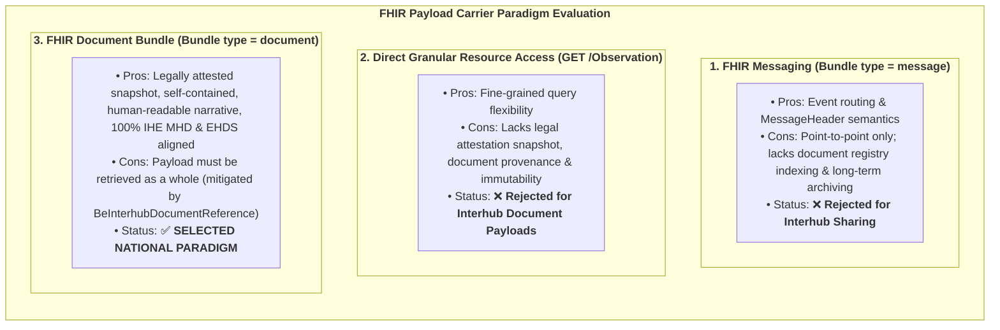
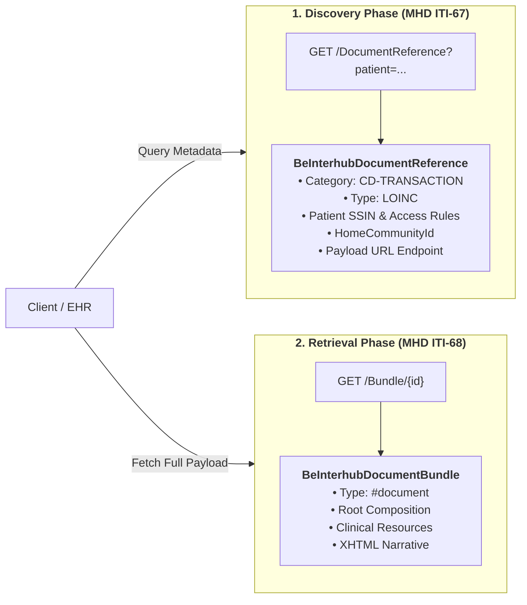

# Architectural & Resource Rationale

## 1. Context & Architectural Problem

The Belgian eHealth Hub network acts primarily as a **document sharing infrastructure**. When migrating from legacy KMEHR SOAP Web Services to HL7 FHIR R4, architects had to determine the optimal FHIR resource paradigms to balance:
1. **Clinical Integrity & Immutability**: A shared medical record (such as a laboratory report or discharge letter) must represent an authenticated snapshot in time that cannot change retroactively without explicit versioning.
2. **Metadata Discovery vs. Content Retrieval**: Separation between lightweight search operations across millions of records and targeted content retrieval.
3. **Decoupled Architecture**: Preserving autonomy between independent hospital electronic health records (EHRs) and regional hubs without requiring complex cross-enterprise database synchronization.
4. **European Harmonization**: Seamless alignment with the **European Health Data Space (EHDS)** and **IHE MHD**.

---

## 2. Evaluation of Evaluated Carrier Paradigms

| Option | Pros | Cons / Reason for Rejection | Selection Status |
| :--- | :--- | :--- | :--- |
| **1. FHIR Messaging** (`Bundle.type = #message`) | Built-in MessageHeader and event routing semantics. | Point-to-point oriented; does not support document indexing, search, & archive. | ❌ Rejected |
| **2. Direct Resource Queries** (RESTful `Observation` / `DiagnosticReport`) | Fine-grained queries on individual resources (e.g. `GET /Observation`). | Lacks document integrity, authorship context, legal attestation, & immutability. | ❌ Rejected |
| **3. FHIR Document Bundle** (`Bundle.type = #document` + Root `Composition`) | Self-contained & immutable snapshot, mandatory narrative for safety, complete clinical context & author, 100% aligned with IHE MHD & EHDS. | Requires full bundle retrieval for viewing (addressed by decoupled metadata). | ✅ **SELECTED PARADIGM** (Mandated) |

### 2.1 Why FHIR Messaging (`Bundle.type = #message`) Was Not Selected
FHIR Messaging is designed for event-driven, asynchronous routing between known communication endpoints (similar to HL7 v2 messages). However, the Belgian Hub ecosystem is an **indexing, discovery, and retrieval** network, where documents must be registered, cataloged, searched years later, and retrieved on demand. Messaging lacks standard document registry query semantics (`ITI-67`).

### 2.2 Why Direct Granular RESTful Resource Access Was Not Selected
Allowing consumers to query isolated `Observation` or `DiagnosticReport` resources directly across federated hospital databases would expose operational hospital EHR systems to high query loads, introduce security risks, and strip away crucial provenance, institutional authorship, and legal signatures. Furthermore, changes in underlying hospital tables could mutate historical records.

### 2.3 The Mandated Solution: FHIR Document Bundles (`Bundle.type = #document`)
The Belgian Interhub standard mandates that **all shared clinical payloads are strictly exchanged as FHIR Bundles of type `document`**:
1. **Immutability & Legal Validity**: A FHIR Document is a legally attested, digitally signable snapshot in time. Once generated, its content is fixed. Revisions require creating a new document version linked via `relatesTo`.
2. **Clinical Safety Narrative (`Composition.section.text`)**: Every document section includes a human-readable XHTML narrative. Clinicians can safely view the content on any workstation, even if the receiving system does not support all discrete code systems.
3. **Self-Contained Completeness**: All resources referenced by the Composition are bundled within the `Bundle.entry` list, eliminating external URL dependencies during retrieval or long-term archiving.

---

## 3. The Role of `DocumentReference` as Discovery Envelope

In accordance with **IHE MHD (ITI-67 / ITI-68)**, the metadata envelope (`BeInterhubDocumentReference`) is decoupled from the document payload:

* **Lightweight Querying**: Searching `DocumentReference` across multiple federated hubs returns small, highly indexable metadata records containing patient SSIN, CD-TRANSACTION category, LOINC type, author, date, and access rules.
* **On-Demand Retrieval**: The consumer fetches the full document payload (`Bundle` type = `document`) only when the clinician requests it, drastically reducing network bandwidth and hub resource utilization.
