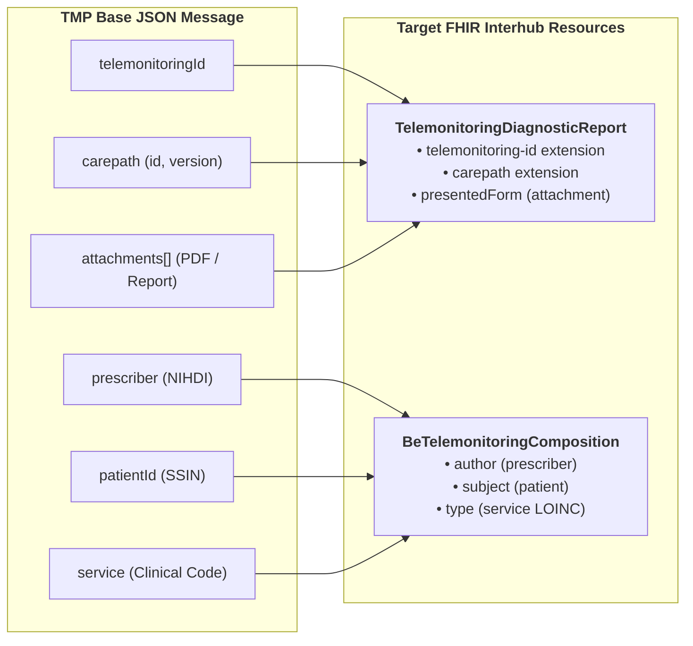

# TMP Message Example

The resources and transformations in this IG start from a basic JSON message that pushes telemonitoring information from a provider to a hospital (or another consumer). 



This is an example of a message that can be sent by a provider:

```json
{
  "telemonitoringId": "",
  "status": "requested",
  "prescriber": "",
  "patientId": "",
  "service": "",
  "prescriberApplication": "",
  "attachments": [
    {
      "id": "",
      "name": "",
      "etag": "",
      "contentType": "application/pdf",
      "contentLanguage": "nl",
      "lastModified": "",
      "uri": "",
      "headers": {
        "additionalProperty": ""
      }
    }
  ],
  "carepath": {
    "id": "",
    "version": ""
  },
  "patientAuthenticationToken": "",
  "patientAuthenticationUrl": ""
}
```
