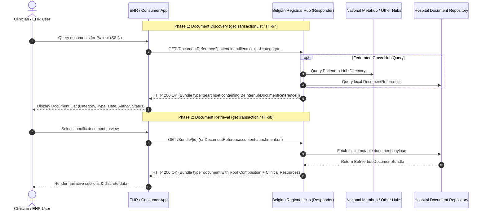
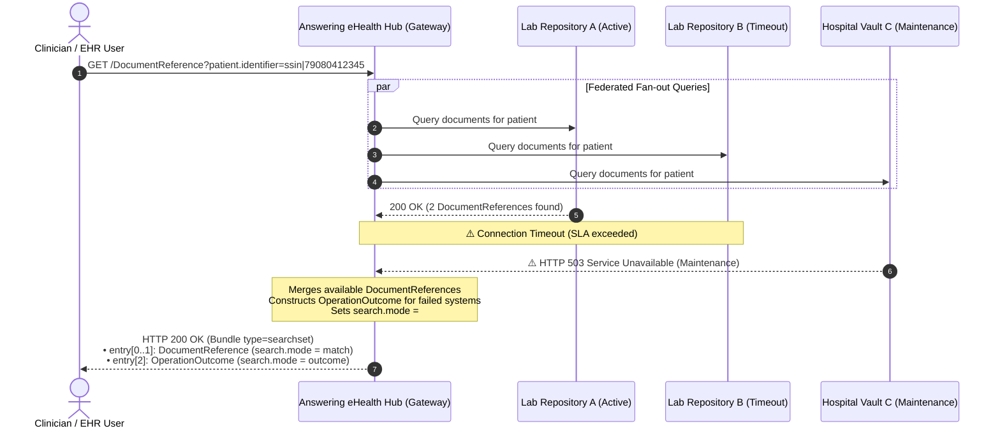
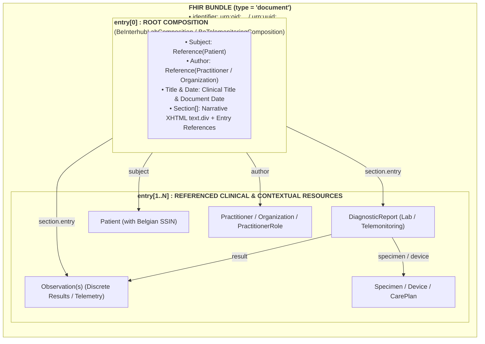

# Interhub Transactions: getTransactionList & getTransaction

## 1. Overview of Interhub Transactions

The Belgian federated hub architecture relies on two core document-sharing interactions:
1. **Document Discovery (`getTransactionList`)**: Enables an EHR, clinical portal, or initiating hub to discover available clinical documents for a patient across all connected regional hubs.
2. **Document Retrieval (`getTransaction`)**: Enables a consumer to retrieve the complete, immutable clinical document payload for a specific transaction.

In the modernized FHIR-based Belgian Interhub standard, these legacy SOAP operations are mapped directly to the **IHE MHD (Mobile access to Health Documents)** profile family on **HL7® FHIR® R4**:

| Legacy KMEHR SOAP Operation | Target IHE MHD / FHIR Transaction | Target Resource / Action | Payload Returned |
| :--- | :--- | :--- | :--- |
| **`getTransactionList`** | **MHD ITI-67** (`Find DocumentReferences`) | `GET [base]/DocumentReference` (RESTful Search) | `Bundle` (type = `searchset`) containing `BeInterhubDocumentReference` entries |
| **`getTransaction`** | **MHD ITI-68** (`Retrieve Document`) / `$document` | `GET [base]/Bundle/[id]` or `GET [base]/Composition/[id]/$document` | Complete `BeInterhubDocumentBundle` (type = `document`) |



---

## 2. Transaction 1: `getTransactionList` (MHD ITI-67 `Find DocumentReferences`)

### 2.1 Trigger & Scope
A healthcare professional, clinical application, or regional gateway initiates this transaction to query for health documents available for a patient identified by their Belgian **SSIN / INSS**.

### 2.2 HTTP Interaction & Query Parameters

```http
GET [base]/DocumentReference?patient.identifier=https://www.ehealth.fgov.be/standards/fhir/core/NamingSystem/ssin|79080412345&category=https://www.ehealth.fgov.be/standards/fhir/core/CodeSystem/cd-transaction|labresult&date=ge2026-01-01T00:00:00Z&date=le2026-12-31T23:59:59Z&status=current&_count=50 HTTP/1.1
Host: hub.cozo.be
Accept: application/fhir+json
Authorization: Bearer <eHealth-OAuth-Token>
```

#### Supported Search Parameters:

| FHIR Search Parameter | Syntax & Modifier | KMEHR Concept | Description |
| :--- | :--- | :--- | :--- |
| **`patient.identifier`** *(Mandatory)* | `token` (`system\|value`) | `folder/patient/id[@S="INSS"]` | Patient's national Social Security Identification Number (SSIN). Systems must support both `https://www.ehealth.fgov.be/standards/fhir/core/NamingSystem/ssin` and `urn:oid:1.3.6.1.4.1.21297.100.1.1`. |
| **`category`** *(Optional)* | `token` (`system\|code`) | `transaction/cd[@S="CD-TRANSACTION"]` | Filters by Belgian document category (e.g. `sumehr`, `labresult`, `discharge`, `telemonitoring`). |
| **`type`** *(Optional)* | `token` (`system\|code`) | `transaction/cd[@S="CD-CLINICAL"]` | Filters by clinical LOINC code (e.g. `http://loinc.org\|11502-2` for Lab Report, `http://loinc.org\|10185-7` for Holter Study). |
| **`date`** *(Optional)* | `date` (`ge`, `le`, `gt`, `lt`) | `transaction/date` & `time` | Filters document creation timestamp within a date/time range. |
| **`author.identifier`** *(Optional)* | `token` (`system\|value`) | `transaction/author/hcparty/id` | Filters by authoring physician NIHDI (`1.3.6.1.4.1.21297.100.9.1`) or institution NIHDI (`100.11.1`). |
| **`status`** *(Optional)* | `token` (`current`, `superseded`) | Document execution status | Filter on metadata status. Defaults to `current`. |
| **`_id`** / **`identifier`** *(Optional)* | `token` | `transaction/id` | Query for a specific document reference by ID. |
| **`_count`** *(Optional)* | `integer` | `maxrows` | Maximum number of results requested per page. |
| **`_sort`** *(Optional)* | `string` (`-date`, `date`) | Order of results | Defaults to descending by creation date (`-date`). |

### 2.3 Response Structure (`Bundle` type = `searchset`)

The answering hub returns an **HTTP 200 OK** with a FHIR `Bundle` of type `searchset`:
* `Bundle.total`: Total number of matching document entries.
* `Bundle.entry[]`: Array of matching `BeInterhubDocumentReference` resources.
* If no matching documents exist, an empty searchset Bundle is returned (`total = 0`, `entry = []`).

```json
{
  "resourceType": "Bundle",
  "id": "bundle-transaction-list-response",
  "type": "searchset",
  "total": 1,
  "entry": [
    {
      "fullUrl": "https://hub.cozo.be/fhir/DocumentReference/docref-lab-example-01",
      "resource": {
        "resourceType": "DocumentReference",
        "id": "docref-lab-example-01",
        "meta": {
          "profile": [
            "https://www.ehealth.fgov.be/standards/fhir/interhub/StructureDefinition/be-interhub-documentreference"
          ]
        },
        "extension": [
          {
            "url": "https://www.ehealth.fgov.be/standards/fhir/interhub/StructureDefinition/be-ext-home-community-id",
            "valueUri": "urn:oid:1.3.6.1.4.1.21297.1.3"
          },
          {
            "url": "https://www.ehealth.fgov.be/standards/fhir/interhub/StructureDefinition/be-ext-patient-access",
            "extension": [
              { "url": "access", "valueCode": "yes" },
              { "url": "accessDate", "valueDate": "2026-03-15" }
            ]
          }
        ],
        "masterIdentifier": {
          "system": "urn:ietf:rfc:3986",
          "value": "urn:oid:1.3.6.1.4.1.21297.100.2.1.815933567"
        },
        "identifier": [
          {
            "system": "urn:ietf:rfc:3986",
            "value": "urn:oid:1.3.6.1.4.1.21297.100.2.1.815933567"
          }
        ],
        "status": "current",
        "docStatus": "final",
        "category": [
          {
            "coding": [
              {
                "system": "https://www.ehealth.fgov.be/standards/fhir/core/CodeSystem/cd-transaction",
                "code": "labresult",
                "display": "Laboratory Result"
              }
            ]
          }
        ],
        "type": {
          "coding": [
            {
              "system": "http://loinc.org",
              "code": "11502-2",
              "display": "Laboratory report"
            }
          ]
        },
        "subject": {
          "identifier": {
            "system": "https://www.ehealth.fgov.be/standards/fhir/core/NamingSystem/ssin",
            "value": "79080412345"
          }
        },
        "date": "2026-03-15T10:30:00Z",
        "author": [
          { "display": "CoZo Regional Hub" },
          { "display": "UZ Leuven" },
          { "display": "Dr. Danièle Govaerts" }
        ],
        "content": [
          {
            "attachment": {
              "contentType": "application/fhir+json",
              "language": "nl-BE",
              "url": "https://hub.cozo.be/fhir/Bundle/bundle-lab-report-example-01",
              "title": "Lab Report - Peeters Jan"
            },
            "format": {
              "system": "https://www.ehealth.fgov.be/standards/fhir/interhub/CodeSystem/be-cs-interhub-format-codes",
              "code": "urn:be:fgov:ehealth:lab:document:1.0",
              "display": "Belgian Lab Report FHIR Document (v1.0)"
            }
          }
        ]
      }
    }
  ]
}
```

### 2.4 Downstream System Unavailability, Partial Failures & OperationOutcome Handling

In a federated healthcare ecosystem, executing a document discovery query (`getTransactionList` / MHD ITI-67) requires the responding eHealth Hub to query numerous underlying clinical repositories, hospital EHR vaults, private laboratory information systems (LIS), and remote partner hubs.

In real-world operations, one or more connected downstream systems may be temporarily unavailable—for instance, undergoing scheduled maintenance, experiencing network partition, or failing to respond within configured SLA timeout windows.



#### 2.4.1 Architectural Rules for Partial Failures

1. **HTTP Status Code**: The answering Hub **MUST return HTTP 200 OK** (not 500, 502, or 504) as long as the search request was syntactically valid and any available portion of the federated network responded.
2. **Searchset Bundle Assembly**:
   * `Bundle.total`: Represents the total count of successfully matched `DocumentReference` records.
   * `Bundle.entry[]` (`search.mode = "match"`): All valid `BeInterhubDocumentReference` resources discovered from responding nodes.
   * `Bundle.entry[]` (`search.mode = "outcome"`): A populated **`OperationOutcome`** resource capturing specific issues for each downstream system that failed to reply.
3. **No Phantom Empty States**: A hub MUST NEVER return an empty `Bundle (total = 0)` without an `OperationOutcome` when underlying systems failed, as this could mislead the treating physician into believing no medical records exist for the patient.

#### 2.4.2 OperationOutcome Issue Structure & Coding

Each failing or timed-out downstream system generates an entry in the `OperationOutcome.issue` list:

| `OperationOutcome.issue` Field | Value / Datatype | Description & Usage |
| :--- | :--- | :--- |
| **`severity`** | `code` (`warning` \| `information`) | Fixed to `warning` for partial failures where other document records are returned. |
| **`code`** | `code` (`timeout` \| `transient` \| `exception` \| `suppressed`) | `timeout`: Downstream system exceeded SLA response time.<br>`transient`: System down for maintenance (HTTP 503).<br>`exception`: Unexpected internal subsystem error.<br>`suppressed`: Records withheld due to patient consent or link policies. |
| **`details`** | `CodeableConcept` | Standard issue type from `http://terminology.hl7.org/CodeSystem/issue-type` with a human-readable text description. |
| **`diagnostics`** | `string` | Diagnostic text explicitly identifying the failing repository/system (including NIHDI license, CBE number, or URI) and stating that records from that location could not be included. |

#### 2.4.3 Complete Searchset Bundle Example with OperationOutcome

Below is a complete example of an HTTP 200 OK searchset response containing two matched laboratory document references and an embedded `OperationOutcome` indicating partial downstream timeouts:

```json
{
  "resourceType": "Bundle",
  "id": "bundle-transaction-list-response-partial",
  "type": "searchset",
  "total": 1,
  "entry": [
    {
      "fullUrl": "https://hub.cozo.be/fhir/DocumentReference/docref-lab-example-01",
      "search": {
        "mode": "match"
      },
      "resource": {
        "resourceType": "DocumentReference",
        "id": "docref-lab-example-01",
        "meta": {
          "profile": [
            "https://www.ehealth.fgov.be/standards/fhir/interhub/StructureDefinition/be-interhub-documentreference"
          ]
        },
        "status": "current",
        "docStatus": "final",
        "category": [
          {
            "coding": [
              {
                "system": "https://www.ehealth.fgov.be/standards/fhir/core/CodeSystem/cd-transaction",
                "code": "labresult",
                "display": "Laboratory Result"
              }
            ]
          }
        ],
        "subject": {
          "identifier": {
            "system": "https://www.ehealth.fgov.be/standards/fhir/core/NamingSystem/ssin",
            "value": "79080412345"
          }
        },
        "content": [
          {
            "attachment": {
              "contentType": "application/fhir+json",
              "language": "nl-BE",
              "url": "https://hub.cozo.be/fhir/Bundle/bundle-lab-report-example-01",
              "title": "Lab Report - Peeters Jan"
            },
            "format": {
              "system": "https://www.ehealth.fgov.be/standards/fhir/interhub/CodeSystem/be-cs-interhub-format-codes",
              "code": "urn:be:fgov:ehealth:lab:document:1.0",
              "display": "Belgian Lab Report FHIR Document (v1.0)"
            }
          }
        ]
      }
    },
    {
      "fullUrl": "urn:uuid:6a28746c-63cf-4a69-8db3-705a5a1f26f2",
      "search": {
        "mode": "outcome"
      },
      "resource": {
        "resourceType": "OperationOutcome",
        "id": "outcome-partial-timeout-example",
        "issue": [
          {
            "severity": "warning",
            "code": "timeout",
            "details": {
              "coding": [
                {
                  "system": "http://terminology.hl7.org/CodeSystem/issue-type",
                  "code": "timeout",
                  "display": "Timeout"
                }
              ],
              "text": "Downstream clinical repository timeout"
            },
            "diagnostics": "Timeout communicating with connected laboratory repository (NIHDI: 71000012). Results from this facility may be incomplete or omitted from this list."
          },
          {
            "severity": "warning",
            "code": "transient",
            "details": {
              "coding": [
                {
                  "system": "http://terminology.hl7.org/CodeSystem/issue-type",
                  "code": "transient",
                  "display": "Transient Issue"
                }
              ],
              "text": "Downstream system unavailable (maintenance)"
            },
            "diagnostics": "Connected hospital vault (NIHDI: 72000034) is currently unavailable due to scheduled maintenance. Historical documents from this facility are temporarily excluded."
          }
        ]
      }
    }
  ]
}
```

#### 2.4.4 Consuming Client & EHR Responsibilities

Consuming EHR systems, clinical portals, and mobile applications consuming `getTransactionList` (MHD ITI-67) **MUST implement the following client behaviors**:

1. **Inspect `search.mode = "outcome"`**: Client parsers must actively scan the `Bundle.entry` array for resources with `resourceType == "OperationOutcome"` (or `search.mode == "outcome"`).
2. **Display Clinical Alert Banners**: When an `OperationOutcome` with severity `warning` is returned, the client user interface MUST present a prominent, non-blocking warning banner to the clinician:
   > ⚠️ **Notice: Document List Incomplete**  
   > *One or more connected clinical repositories did not respond (e.g. system maintenance or timeout). Some historical patient documents may not appear in this list.*
3. **Auditability**: The client system SHOULD log the diagnostics in local access audit logs so support desks can diagnose why specific records were temporarily omitted.

---

## 3. Transaction 2: `getTransaction` (MHD ITI-68 `Retrieve Document`)

### 3.1 Trigger & Scope
Triggered when a consumer selects a document from the search results to view or import the full clinical payload.

### 3.2 HTTP Interaction

```http
GET https://hub.cozo.be/fhir/Bundle/bundle-lab-report-example-01 HTTP/1.1
Accept: application/fhir+json
Authorization: Bearer <eHealth-OAuth-Token>
```

Alternatively, servers may support the FHIR `$document` operation on the Composition resource:
```http
GET https://hub.cozo.be/fhir/Composition/comp-lab-example-01/$document HTTP/1.1
Accept: application/fhir+json
```

### 3.3 Payload Structure: Strictly FHIR Bundles of Type `document`

In the Belgian Interhub standard, **all retrieved transaction payloads are strictly Bundles of type `document` (`Bundle.type = #document`)**:



#### Bundle Constraints:
* **`Bundle.type`**: Fixed to `#document`. No other bundle types (`collection`, `transaction`, `batch`) are permitted for shared clinical document payloads.
* **`Bundle.entry[0]`**: MUST be a valid `Composition` conforming to the relevant profile (`BeInterhubLabComposition`, `BeTelemonitoringComposition`, etc.).
* **Narrative Requirement (`Composition.section.text`)**: In accordance with FHIR and Belgian clinical safety guidelines, every section MUST include human-readable XHTML narrative (`status = #generated` or `#extensions`), ensuring safe rendering on any clinical workstation.
* **Completeness**: The document bundle must be **self-contained**. All resources referenced in the Composition sections must be bundled inside the `Bundle.entry` array.

---

## 4. Error Codes & Exception Crosswalk

| KMEHR SOAP Fault / Exception | HTTP Status | FHIR `OperationOutcome.issue.code` | Remediation / Clinical Context |
| :--- | :--- | :--- | :--- |
| **`Invalid patient identifier`** | `400 Bad Request` | `value` / `invalid` | The supplied SSIN is malformed or checksum failed. |
| **`Therapeutic link does not exist`** | `403 Forbidden` | `forbidden` / `security` | Requesting practitioner does not have an active therapeutic link with the patient. |
| **`National consent missing`** | `403 Forbidden` | `suppressed` | Patient has not given consent to share health records via the eHealth platform. |
| **`Document withheld by physician`** | `403 Forbidden` | `forbidden` | Patient access is withheld (`PatientAccess = no` or `never`). |
| **`No transaction found with provided id`** | `404 Not Found` | `not-found` | The requested document uniqueId does not exist in the repository. |
| **`Owner outside of network`** | `502 Bad Gateway` | `exception` | The target repository or home community is unreachable. |
| **`Technical error`** | `500 Internal Error` | `transient` / `exception` | Internal repository failure. |
